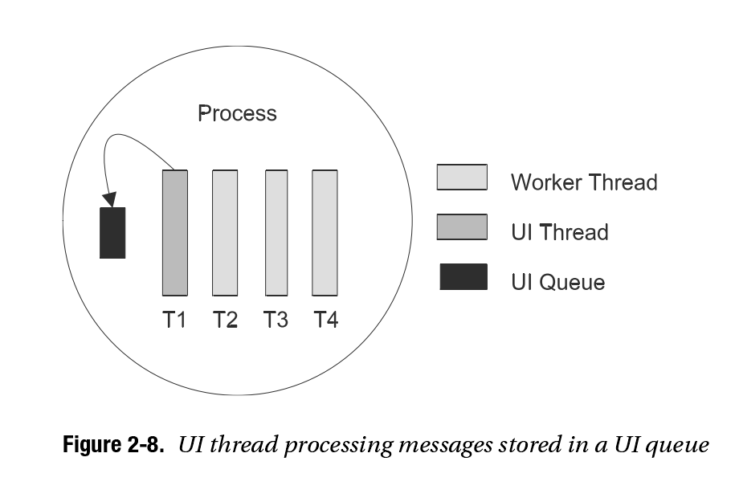
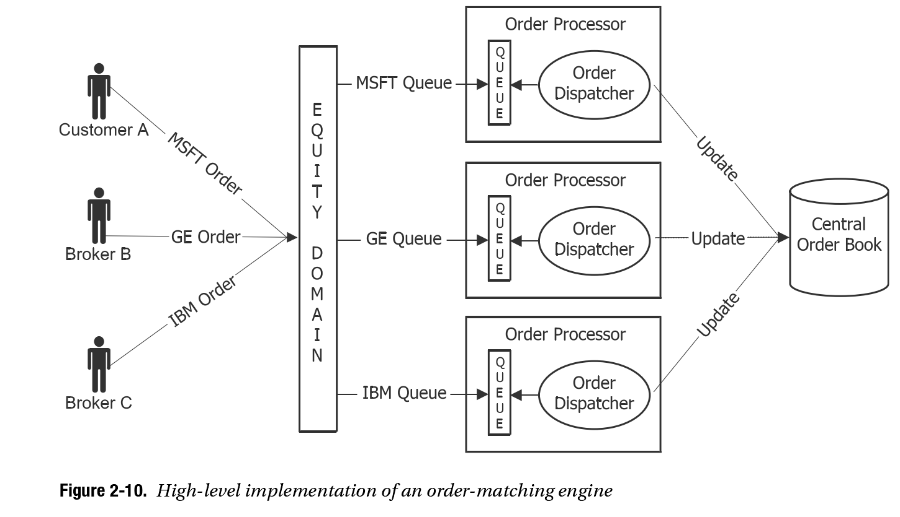
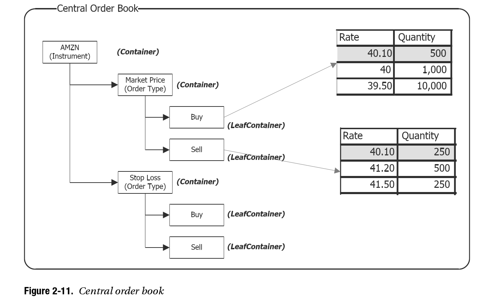
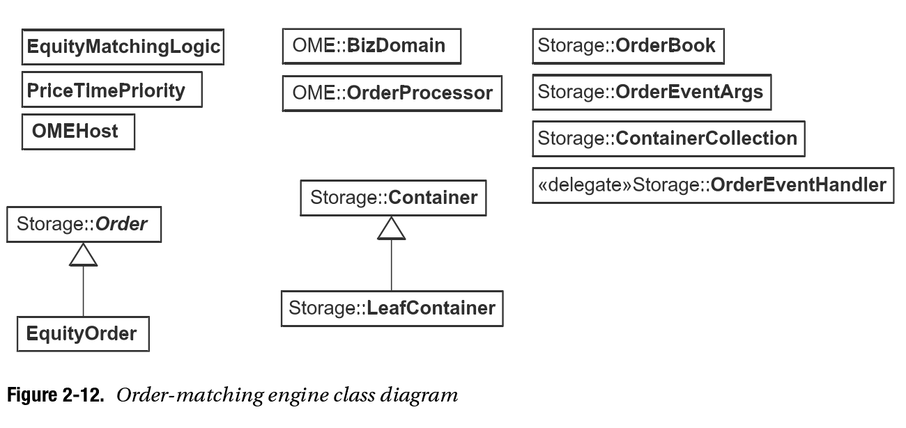
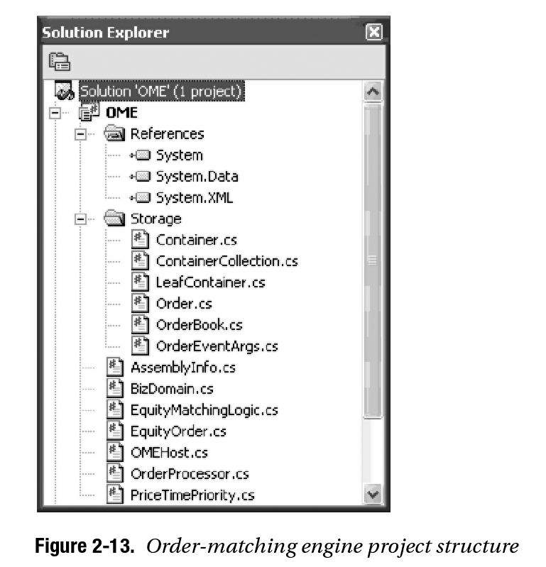

# 第二章 订单撮合引擎

The beauty of time is that it controls the construction and destruction of each instance of the human type.
This chapter discusses an important wing of the trading system—the order-matching decision
process. All trading systems must be able to process orders placed by multiple customers from mul-
tiple locations, with several orders arriving at the same time and desperately trying to grab the best
price in the market at that particular moment. Therefore, it is not surprising to note that trading
systems face an influx of data during peak periods. Thus, the systems must easily withstand the
heavy traffic of orders and still be able to judiciously find the best price in the market for a given
order at the given time.
In this chapter, we explain how an order is matched as soon as it is received and explain the
variants that an order exhibits, which in turn affects the matching process. The first part of this chapter
discusses the business know-how; then the chapter covers the .NET Framework and exposes the
tools that will enable the fulfillment of the discussed business case. Specifically, we explain the differ-
ent types of collection classes available in the .NET Framework, and we then continue the technical
exploration with in-depth coverage of the threading features and the types of synchronization methods
that are essential for building a thread-safe system. This is followed by the merging stage where every
aspect of business is directly mapped to its low-level technical implementation. Finally, we provide
illustrative code samples for the prototype of an order-matching engine written in C#.

*时间的优雅之处在于它可以掌控所有人类的生死*

 
## 理解订单撮合的业务实体
Understanding the Business Context of Order Matching
The following sections cover the business context of the order-matching engine.
The Need for Efficient Order Matching
The two primary objectives in the financial marketplace are to keep transaction costs at a minimum
and to avoid credit defaults. Although several market practices have been devised to fulfill these
objectives, efficient order matching is an important factor for achieving these goals.
A market’s liquidity is measured by how easily a trader can acquire (or dispose of ) a financial
asset and by the cost associated with each transaction. For example, if you wanted to sell a house,
you could place an advertisement or go through a real estate agent. Both of these options have costs
associated with them. It may also take a month to locate a buyer who is willing to match the price you
desire. In this case, the house is considered to be relatively illiquid. But imagine a marketplace where
all sellers and buyers of houses in the city came together in one area and tried to find a match—the
search would be easier, the chances for finding a buyer would be greater, and the convergence of all
buyers and sellers would result in price discovery and hence better prices. In this case, the house is
4142C H A P T E R 2 ■ T H E O R D E R - M AT C H I N G E N G I N E
considered highly liquid. If you extend this example to a marketplace where company instruments
(shares and debt instruments) are traded, you get a stock exchange, as introduced in Chapter 1. To
avoid search costs (and of course to enforce other legal statutes), buyers and sellers come together
in a stock exchange on a common platform to transact. Since many buyers and sellers are present at
any point in time, searching for a counterpart for an order is relatively easy.
An order is an intention to enter into a transaction. Each order has certain characteristics such
as type of security, quantity, price, and so on. Initiators of orders notionally announce their willing-
ness to transact with the specified parameters.
Each player in the market wants to get the best possible price. There is a huge scramble to get
one’s order executed at the right time and at the best available market price. Efficient order match-
ing is thus a highly desirable tenet of an advanced market.
Also, anonymity is considered good for a financial market. This means traders do not know any
information about the people with whom they are trading. This is desirable when the participants
in the market do not have the same financial strength and when it becomes important for the mar-
ket to protect the interests of the small players. Anonymity also prevents large players from exerting
undue influence on the trade conditions. In such a situation, to protect the integrity of the market,
precautions must be taken to ensure that no credit defaults take place. As mentioned in Chapter 1,
this is the job of a clearing corporation, which takes away the credit risk concerns of large players
through novation. This process also takes care of matching large orders with several potential small
players.
Actors: Exchanges and Brokers
Let’s examine who the actors are in this matching process. Two counterparties, at a minimum, are
required with opposing views to trade with each other—after all, one must be willing to buy when
another is willing to sell. And their orders must converge on a common platform, which is the exchange.
Generally, exchanges support two forms of trading:
  Oral auctions
  Electronic trading
In an oral auction, traders meet each other face to face on the exchange’s trading floor. They
shout their bids and offer prices for other traders to hear; the other traders constantly write down
these quotes. When two traders agree on a price and an associated quantity, a transaction takes
place. Some traders may provide a two-way quotation (a bid price and an asking price) and enter
into a transaction only with another trader willing to take the offer or accept the bid.
Oral auctions are the conventional form of trading used in absence of automation, but with the
advent of electronic trading, they are on verge of decline. Electronic trading offers the same function
through a computer and a trading screen. Traders log their orders through the trading system, and
their orders are recorded in the exchange’s order book. These orders are then considered for poten-
tial matches as designated per the order-matching rules and algorithm defined by exchange.
The most common matching logic uses the concept of priority based on price and time:
  All buy orders received by the exchange are first sorted in descending order of bid price and
in ascending order of time for the same prices. This means orders where traders are willing
to pay the highest price are kept on the top, reflecting the highest priority. If two orders have
the same bid price, the one entered earlier gains a higher priority over the one entered later.
  All sell orders are sorted in ascending order by offer price and in ascending order of time for
the same offer prices. This means orders where traders are willing to accept the lowest rate
are kept on the top, giving them the highest priority. Two orders asking the same price would
be prioritized such that the one entered earlier gets a higher priority.C H A P T E R 2 ■ T H E O R D E R - M AT C H I N G E N G I N E 43
For example, consider traders A, B, and C who want to buy shares of Microsoft and traders D, E,
and F who want to sell shares of Microsoft. Assuming the last traded price of Microsoft (MSFT) shares
was $40, consider the scenario shown in Table 2-1.
Table 2-1. Traders Who Want to Buy/Sell MSFT Orders
Traders Who Want to Buy Traders Who Want to Sell
A wants to buy 1,000 @ $40. D wants to sell 250 @ $40.10.
B wants to buy 500 @ $40.10. E wants to sell 500 @ $41.20.
C wants to buy 10,000 @ $39.50. F wants to sell 250 @ $41.50.
A separate bucket is assigned for each company’s stock, and all orders for the company are
grouped into the specific bucket. In business lingua, this bucket is called the order book. Thus, the
order book for the example in Table 2-1 will look like Table 2-2.
Table 2-2. MSFT Order Book
Buy Sell
Quantity Rate Rate Quantity
500 $40.10 $40.10 250
1,000 $40 $41.20 500
10,000 $39.50 $41.50 250
All transactions happen on the rate reflected in the topmost row of the order book. This price is
popularly called the touchline price. The touchline price represents the best ask (lowest sell) price and
best bid (highest buy) price of a stock.
In the previous example, because there is a consensus on the rates from both the buyer and the
seller, at the touchline price the order will get matched to the extent of 250 shares at $40.10. Thus,
the order book will look like Table 2-3.
Table 2-3. Updated MSFT Order Book After Buy and Sell Order
Matched at Touchline Price
Buy Sell
Quantity Rate Rate Quantity
250 $40.10 $41.20 500
1,000 $40 $41.50 250
10,000 $39.50
Types of Orders
The following are the most common types of orders:
Good till cancelled (GTC) order: A GTC order is an order that remains in the system until the
trading member cancels it. It will therefore be able to span several trading days until the time it
gets matched. The exchange specifies the maximum number of days a GTC order can remain
in the system from time to time.44C H A P T E R 2 ■ T H E O R D E R - M AT C H I N G E N G I N E
Good till date (GTD) order: A GTD order allows the trading member to specify the days or a date
up to which the order should stay in the system. At the end of this period, the order will auto-
matically get flushed from the system. All calendar days, including the starting day in which the
order is placed and holidays, are counted. Once again, the exchange specifies the maximum
number of days a GTD order can remain in the system from time to time.
Immediate or cancel (IOC) order: An IOC order allows a trading member to buy or sell a security
as soon as the order is released into the market; failing that, the order will be removed from the
market. If a partial match is found for the order, the unmatched portion of the order is cancelled
immediately.
Price conditions/limit price order: This type of order allows the price to be specified when the
order is entered into the system.
Market price order: This type of order allows buying or selling securities at the best price, obtain-
able at the time of entering the order. The price for such orders is left blank and is filled at the
time of the trade with the latest running price in the exchange.
Stop loss (SL) price/order: SL orders allow the trading member to place an order that gets acti-
vated when the market price of the relevant security reaches or crosses a threshold price. Until
then, the order does not enter the market. A sell order in the SL book gets triggered when the
last traded price in the normal market reaches or falls below the trigger price of the order.
Note that for all of these order types, the behavior of an order is determined by a set of special
attributes. Every order entered by a buyer or seller follows the same basic principle of trading, but
this special attribute further augments the nature of an order by having a direct (or indirect) effect
on the profitability of a business. For example, if an order’s last traded price was $15 and a limit buy
order was placed with a limit price of $15.45 with a stop loss at $15.50, this order would be sent to
the market only after the last traded price is $15.50, and it would be placed as a limit price order
with the limit price of $15.45.
Order Precedence Rules
The order precedence rules of an oral auction determine who can bid (or offer) and whose bids and
offers traders can accept. To arrange trades, markets with order-matching systems use their order
precedence rules to separately rank all buy and sell orders in the order of increasing precedence. In
other words, they match orders with the highest precedence first.
The order precedence rules are hierarchical. Markets first rank orders using their primary order
precedence rules. If two or more orders have the same primary precedence, markets then apply their
secondary precedence rules to rank them. They apply these rules one at a time until they rank all
orders by precedence.
All order-matching markets use price priority as their primary order precedence rule. Under
price priority, buy orders that bid the highest prices and sell orders that offer the lowest prices rank
the highest on their respective sides. Markets use various secondary precedence rules to rank orders
that have the same price. The most commonly used secondary precedence rules rank orders based
on their times of submission.
Most exchanges give an option to traders to hide the total quantity of shares they want to trans-
act. This is to discourage other traders from changing their bids/offers in case a large order hits the
market. In this case, displayed orders are given higher precedence over undisclosed orders at the same
price. Markets give precedence to the displayed orders in order to encourage traders to expose their
orders. Though disclosure is encouraged, traders also have the option of not displaying the price in
order to protect their interests.C H A P T E R 2 ■ T H E O R D E R - M AT C H I N G E N G I N E 45
Size (quantity) precedence varies by market. In some markets, small orders have precedence over
large ones, and in some markets the opposite is true. Most exchanges allow traders to issue orders
with size restrictions. Traders can specify that their entire order must be filled at once, or they can
specify a minimum size for partial execution. Orders with quantity restriction usually have lower
precedence than unrestricted orders because they are harder to fill.
Order Precedence Ranking Example
Assume that some traders enter the orders shown in Table 2-4 for a particular security.
Table 2-4. Buy and Sell Orders Sorted Based on Order Arrival Time
Time (a.m.) Trader Buy/Sell Quantity Price
10:01 Anthony Buy 300 $20
10:05 Anu Sell 300 $20.10
10:08 Nicola Buy 200 $20
10:09 Jason Sell 500 $19.80
10:10 Jeff Sell 400 $20.20
10:15 Nicholas Buy 500 Market price order
10:18 Kumar Buy 300 $20.10
10:20 Doe Sell 600 $20
10:29 Sally Buy 700 $19.80
The exchange will send an order acknowledgment to the traders’ trading terminals and fill the
order book as shown in Table 2-5.
Table 2-5. Order Book (Pre-Match)
Buy Order Buy Order Buy Sell Sell Order Sell Order
Time Stamp Quantity Price Buyer Price Quantity Seller Time Stamp
10:15 500 Market Nicholas $19.80 500 Jason 10:09
10:18 300 $20.10 Kumar $20 600 Doe 10:20
10:01 300 $20 Anthony $20.10 300 Anu 10:05
10:08 200 $20 Nicola $20.20 400 Jeff 10:10
10:29 700 $19.80 Sally
Note the following in the order book:
  Jason’s sell order has the highest precedence on the sell side because it offers the lowest price.
  Nicholas’ buy order has the highest precedence on the buy side because it is a market price
order.
  Anthony’s order and Nicola’s order have the same price priority, but Anthony’s order has time
precedence over Nicola’s order because it arrived first.
  In the actual order book, names are not stored and not displayed to traders because the trading
system preserves anonymity.46C H A P T E R 2 ■ T H E O R D E R - M AT C H I N G E N G I N E
The Matching Procedure
The first step is to rank the orders. Ranking happens on a continuous basis when new orders arrive.
Then the market matches the highest-ranking buy and sell orders to each other. If the buyer is
willing to pay as much as the seller demands, the order will be matched, resulting in a trade.
A trade essentially binds the two counterparties to a particular price and quantity of a specific
security for which the trade is conducted.
If one order is smaller than the other, the smaller order will fill completely. The market will then
match the remainder of the larger order with the next highest-ranking order on the opposite side of
the market. If the first two orders are of the same size, both will fill completely. The market will then
match the next highest-ranking buy and sell orders. This continues until the market arranges all
possible trades.
Order-Matching Example
If the traders in the previous example (see Table 2-5) submit their orders, the market will match the
orders as follows:
1. Nicholas’s buy order at market price will match Jason’s sell order. This will result in the first
trade, and both the orders will be removed from the order book.
2. Kumar’s order of 300 buy will get matched to Doe’s order of 600 sell. Interestingly, this order
will get matched at $20.10 even though Doe wanted to sell at $20. Exchange systems are
designed to protect the interests of both buyers and sellers. Since there was a passive order
from Kumar willing to buy at $20.10 and Doe’s order comes in later asking only for $20, she
will still get $20.10. Since Kumar’s order is completely filled, it will be removed completely
from the order book. However, Doe’s order of 600 is only half-filled. So, 300 shares of Doe
will remain in the order book.
3. In the next step, Anthony’s buy order of 300 shares will get fully filled by Doe’s balance of 300
at $20, and both orders will be removed from the order book.
4. Now Nicola wants to buy 200 at $20, but Jeff will sell only at $20.20. There is no agreement in
price; hence, there will be no further matching, and the matching system will wait either for
one of the parties to adjust the price or for a new order at a price where either a buy or a sell
can be matched.
Table 2-6 shows the trade book for trades resulting from these orders.
Table 2-6. Trade Book
Trade Buyer Seller Quantity Price
1 Nicholas Jason 500 $19.80
2 Kumar Doe 300 $20.10
3 Anthony Doe 300 $20
Table 2-7 shows the order book after matching.
Table 2-7. Order Book (Post-Match)
Buy Order Buy Order Buy Sell Sell Order Sell Order
Time Stamp Quantity Price Buyer Price Quantity Seller Time Stamp
10:08 200 $20 Nicola $20.20 400 Jeff 10:10
10:29 700 $19.80 SallyC H A P T E R 2 ■ T H E O R D E R - M AT C H I N G E N G I N E 47
When the buy side matches with the sell side at an agreed price, the order finds a match, thereby
converting it to a trade. Each order can get converted into a single trade or multiple trades, in case
the order size is large. Traders whose orders get executed have to make payments when they buy or
have to deliver the securities when they sell.
Containment of Credit Risk and the Concept of Novation
Millions of orders get executed everyday, with each trader transacting hundreds and sometimes
thousands of trades. In such a process, traders potentially commit to pay others (from whom they
bought) and anticipate the receipt of money from others (to whom they sold). Imagine if one of the
traders exhausted his payment capacity and defaulted. His default would actually give rise to a chain
of defaults, and the integrity of the market as a whole would be in danger. In such a scenario, it would
be difficult for large traders to transact with small traders. This, in turn, would raise transaction costs,
because traders would start selectively trading with each other. To circumvent this credit risk and
bring about confidence in the minds of traders, clearing corporations implement novation.
■Note Novation is a Latin word that means splitting.
Novation essentially splits every transaction into two parts and replaces one party in the trade
with the clearing corporation. So, each party in the transaction feels they have transacted with the
clearing corporation.
For example, assume that the orders of buyer A and seller B match for 10,000 shares of
Microsoft. In the absence of novation, the trade will look like Figure 2-1.
With novation in place, the trade gets split in two and looks like Figure 2-2.
Buyer A pays money and receives the shares from the clearing corporation. The clearing corpo-
ration, in turn, collects the shares and pays the money to seller B.
This brings us to the end of the discussion about the business know-how of order matching. The
next section explains the relevant features of .NET that you can use to automate this business case.
Figure 2-1. Example of trade without novation
Figure 2-2. Example of trade with novation

下文将介绍订单撮合殷勤的业务实体。

### 高效订单撮合的需求

The two primary objectives in the financial marketplace are to keep transaction costs at a minimum and to avoid credit defaults. Although several market practices have been devised to fulfill these objectives, efficient order matching is an important factor for achieving these goals.
A market's liquidity is measured by how easily a trader can acquire (or dispose of) a financial asset and by the cost associated with each transaction. For example, if you wanted to sell a house,you could place an advertisement or go through a real estate agent. Both of these options have costs associated with them. It may also take a month to locate a buyer who is willing to match the price you desire. In this case, the house is considered to be relatively illiquid. But imagine a marketplace where all sellers and buyers of houses in the city came together in one area and tried to find a match-the search would be easier, the chances for finding a buyer would be greater, and the convergence of all buyers and sellers would result in price discovery and hence better prices. In this case, the house is considered highly liquid. If you extend this example to a marketplace where company instruments(shares and debt instruments) are traded, you get a stock exchange, as introduced in Chapter 1. To avoid search costs (and of course to enforce other legal statutes), buyers and sellers come together in a stock exchange on a common platform to transact. Since many buyers and sellers are present at any point in time, searching for a counterpart for an order is relatively easy.
An order is an intention to enter into a transaction. Each order has certain characteristics such as type of security, quantity, price, and so on. Initiators of orders notionally announce their willingness to transact with the specified parameters.
Each player in the market wants to get the best possible price. There is a huge scramble to get one's order executed at the right time and at the best available market price. Efficient order matching is thus a highly desirable tenet of an advanced market.
Also, anonymity is considered good for a financial market. This means traders do not know any information about the people with whom they are trading. This is desirable when the participants in the market do not have the same financial strength and when it becomes important for the market to protect the interests of the small players. Anonymity also prevents large players from exerting undue influence on the trade conditions. In such a situation, to protect the integrity of the market,precautions must be taken to ensure that no credit defaults take place. As mentioned in Chapter 1,this is the job of a clearing corporation, which takes away the credit risk concerns of large players through novation. This process also takes care of matching large orders with several potential small players.

金融市场两个主要的目标是保持交易成本的最小化和避免信用违约，

### 参与者：交易所和经纪商

让我们看看撮合过程中有哪些参与者。

### 订单类型

以下是最常见的订单类型：

* Good till cancelled(GTC):
* Good till date(GTD):
* Immediate or cancel(IOC):
* Price conditions/limit price order:限价单
* 市价单：这种订单允许以订单发出时的买卖最优价成交，
* 止损单：止损单允许交易者
* 
以上这些订单，其行为由一系列的属性确定

### 订单优先规则

柜台竞价的订单优先规则决定谁提供买价(或者卖价)，谁的买入或者卖出能被接受。
The order precedence rules of an oral auction determine who can bid (or offer) and whose bids and
offers traders can accept. To arrange trades, markets with order-matching systems use their order
precedence rules to separately rank all buy and sell orders in the order of increasing precedence. In
other words, they match orders with the highest precedence first.
 
The order precedence rules are hierarchical. Markets first rank orders using their primary order
precedence rules. If two or more orders have the same primary precedence, markets then apply their
secondary precedence rules to rank them. They apply these rules one at a time until they rank all
orders by precedence.
All order-matching markets use price priority as their primary order precedence rule. Under
price priority, buy orders that bid the highest prices and sell orders that offer the lowest prices rank
the highest on their respective sides. Markets use various secondary precedence rules to rank orders
that have the same price. The most commonly used secondary precedence rules rank orders based
on their times of submission.
Most exchanges give an option to traders to hide the total quantity of shares they want to transact. This is to discourage other traders from changing their bids/offers in case a large order hits the
market. In this case, displayed orders are given higher precedence over undisclosed orders at the same
price. Markets give precedence to the displayed orders in order to encourage traders to expose their
orders. Though disclosure is encouraged, traders also have the option of not displaying the price in
order to protect their interests.

Size (quantity) precedence varies by market. In some markets, small orders have precedence over
large ones, and in some markets the opposite is true. Most exchanges allow traders to issue orders
with size restrictions. Traders can specify that their entire order must be filled at once, or they can
specify a minimum size for partial execution. Orders with quantity restriction usually have lower
precedence than unrestricted orders because they are harder to fill.

数量优先规则因交易所而异。在一些市场中，小单比大单的优先级更高，而在一些市场恰好相反。大多数交易所允许交易员

### 订单优先排序示例 Order Precedence Ranking Example

假设一些交易者输入如表2-4所示，特定股票的订单。

| Time (a.m.) | Trader | Buy/Sell| Quantity| Price|
| ---- | ---- | ---- | ---- |:--- |
| 10:01 | Anthony | Buy | 300 | $20 |

10:05 Anu Sell 300 $20.10
10:08 Nicola Buy 200 $20
10:09 Jason Sell 500 $19.80
10:10 Jeff Sell 400 $20.20
10:15 Nicholas Buy 500 Market price order
10:18 Kumar Buy 300 $20.10
10:20 Doe Sell 600 $20
10:29 Sally Buy 700 $19.80

### 撮合步骤

第一步是对订单排序。当收到新订单时，会重新排序。
然后市场会撮合最高的卖单

### 订单撮合示例 Order-Matching Example

### 遏制信用风险和创新概念 Containment of Credit Risk and the Concept of Novation

## 2.2 .NET集合简介 Introducing .NET Collections

Introducing .NET Collections
Data structures provide a container for storing “arbitrary” data and provide a uniform mechanism to
operate on this data. Data structures and algorithms share a bloodline relationship—each algorithm
is specifically designed and tuned to work with a specific data structure. Therefore, when a specific
algorithm is applied on the appropriate data structure, it yields the best possible result. For instance,
numerous algorithms can iterate over data stored in a data structure, but often one will work faster
than the other when applied in the appropriate environment.
The real litmus test for the performance of an algorithm is to apply it on a huge collection of data
elements and then compare the results with that of other similar algorithms. The reason for such an
evaluation is that algorithms tend to predict satisfactory results—or at worst only marginal differ-
ences when applied on a small amount of data with poor data density. It is only when the number of
elements in the data structure increases that the algorithm loses its strength and eventually deterio-
rates in performance.
The venture of a right algorithm and data structure is the Holy Grail of any good data operation
exercise. The scope of a data operation is not only limited to inserting or deleting a data element but,
more important, is also limited to seeking data elements. The key to the success of any “data-seeking”
activity is directly attributed to the efficiency of the algorithm, denoted by the number of iterations
it takes to locate an item. This number is derived from the worst-case scenario list; for example, in
a linear list of 50 elements where items are inserted in sequential order, it can take at most 50 itera-
tions to locate an item. So, the efficiency of the algorithm is determined by the number of elements
stored inside the data structure and is measured based on the following two factors:
  Time (the amount of computation required by the algorithm)
  Space (the amount of memory required by the algorithm)
The efficiency of an algorithm is represented in Big-O notation, which acts as a barometer for
measuring the efficiency of algorithms. Big-O notation allows a direct comparison of one algorithm
over another. The value denoted by Big-O form is sufficient enough to draw a rational comparison
between two algorithms without looking at the real code and understanding the real mechanics.
This concludes the brief introductory journey into algorithms; it is time to step back into the .NET
world and understand the various types of data structures defined under the System.Collections
namespace.
Arrays
Arrays have been in existence since the genesis of the computing world. They are a basic necessity
of every developer; hence, you will find their implementations molded into all programming languages.
Arrays are tightly coupled types, and therefore they are known as homogenous data structures (see
Figure 2-3). This means once an array of a particular data type is declared, it ensures that the data
elements stored must be of the same type.
Figure 2-3. Linear arrangement of a homogeneous order using an array

In the previous code, an array of the Order type is declared by allocating space for three elements.
Then the code assigns a value to an individual element of an array. The primary benefit of using an
array is the simplicity it provides in manipulating data elements. An individual data element is accessed
by its ordinal position, using an index. An array is extremely efficient when it comes to searching for
a data element, even if the number of elements stored in the array is large. Another benefit of using
an array is it provides good locality of reference because data elements are arranged in a contiguous
block of memory. An array is one of the basic foundations for building sophisticated data structures.
These data structures are queues, stacks, and hash tables, and their underlying implementations in
.NET are based on arrays.
Array Lists
Array lists inherit the same characteristics of arrays but are specifically designed to address the
shortcomings of arrays (see Figure 2-4).
The foremost problem faced by an array is it is a fixed size—once allocated, an array cannot be
resized in a straightforward manner. The array size is defined either during runtime or during compile
time. After that, the size remains fixed for the entire duration of the program. The only way to redi-
mension an array is to apply a crude approach—by allocating a separate temporary array (which
acts as a temporary storage container for the old data elements), moving the elements from the
source array to the temporary array, and then reallocating a different size to the source array, as
illustrated in the following code:
Figure 2-4. Linear arrangement of a heterogeneous order using an array list

Array lists alleviate the fixed-size problem faced by arrays. Behind the scenes, array lists follow
the same crude mechanism demonstrated in the previous code, but the mechanism is transparent to
developers. Developers, without worrying about dimension issues, can add data element at runtime.
The other major problem faced by an array is the “type coupleness” behavior. An array list solves
this problem by acting as a universal container and allows you to insert a data element of any data
type. This means an instance of both the value types and the reference type is allowed. However, be
careful when dealing with value types because of the implicit boxing and unboxing penalty cost
incurred at runtime. The internal storage implementation of an array list is of the reference type, and
an instance of the value type that is allocated on the stack cannot be straightforwardly assigned to
a reference type. To achieve this task, the instance of the value type needs to be converted to a ref-
erence type through a process known as boxing. Similarly, in the reverse process known as unboxing,
the boxed value type that is a reference type is converted to its original value type.
The following code example demonstrates various operations performed on array lists and
how different types of orders are added, retrieved, and finally removed:

*数据结构*为存储任意数据提供了容器，和统一操作数据的机制。数据结构和算法紧密相连，每个算法都是专门设计和调整服务于数据结构。因此，当特定算法应用于合适的数据结构时，可能会获得更好的结果。比如说，数值算法可以迭代数据并将其存在数据结构中，但是在合适的环境中，经常会有人运行的比其他人更快。

### 2.2.1 数组 Array

*数组*自计算机发明以来就已经出现了。它是每个开发人员必须的，因此，你能在所有编程语言中都能找到它的实现。

以下代码演示了在.NET中如何使用一个数组数据结构：

	using System;
	class ArrayContainer
	{
		class Order
		{}
		static void Main(string[] args)
		{
			//Create orders
			Order order1 = new Order();
			Order order2 = new Order();
			Order order3 = new Order();
			//Declare array of order type
			//and add the above three order instance
			Order[] orderList = { order1,order2,order3};
			//Access the order
			Order curOrder = orderList[1] as Order;
		}
	}

### 2.2.2 数组列表 Array Lists
*数组列表*继承了数组的特性，但其设计解决数组的弱点。

	using System;
	class ArrayCopy
	{
		class Order{}
		[STAThread]
		static void Main(string[] args)
		{
			//Create an order array
			Order[] orderList = { new Order(),new Order(),
			new Order(),new Order()};
			//Create a temp array of exactly the same size
			//as original order container
			Order[] tempList = new Order[4];
			//copy the actual items stored in the order array
			//to temp order array
			Array.Copy(orderList,0,tempList,0,4);
			//resize the order array
			orderList = new Order[5];
			//copy the order items from the temp order array
			//to the original order array
			Array.Copy(tempList,0,orderList,0,4);
		}
	}

下面代码示例演示了数组列表的多种操作，不同类型的订单是如何被添加、获取和最终被移除的。

	using System;
	using System.Collections;
	class ArrayListContainer
	{
		class Order
		{}
		class LimitOrder
		{}
		class IOCOrder
		{}
		[STAThread]
		static void Main(string[] args)
		{
			ArrayList orderContainer;
			orderContainer = new ArrayList();
			//Add regular order
			Order order = new Order();
			orderContainer.Add(order);
			//Add limit order
			LimitOrder limOrder = new LimitOrder();
			orderContainer.Add(limOrder);
			//Add IOC order
			IOCOrder iocOrder =new IOCOrder();
			orderContainer.Add(iocOrder );
			//Access limit order
			limOrder = orderContainer[0] as LimitOrder;
			//Remove limit order
			orderContainer.RemoveAt(0);
			//Display total elements
			Console.WriteLine("Total Elements : " +orderContainer.Count);
		}
	}

### 2.2.3 快速排序和二分查找 Quick Sort and Binary Search

数组和数组列表都提供简单的方法插入和删除元素。然而，你必须考虑到查找特定数据元素需要的代价。最简单的方案是在整个数组执行一个顺序搜索
Both arrays and array lists provide a simple way to insert and delete an item. However, you must
also take into account the cost involved in locating a specific data element. The simple technique is to
conduct a sequential search where the entire array is enumerated element by element. This approach
sounds sensible if you have only a few elements but proves to be inefficient for large numbers of
items. Additionally, often you have requirements to sort arrays in either ascending order or descending
order. This requirement for both searching and sorting elements illustrates the need for efficient
searching and sorting algorithms. Although several well-known, robust sorting and searching algo-
rithms exist, .NET provides out-of-the-box quick sort and binary search algorithms to cater to the sort
and search requirements. The quick sort is considered to be one of the most highly efficient sorting
algorithms.
The following code demonstrates how elements of arrays are sorted using the quick sort
algorithm:

	using System;
	class QuickSort
	{
		static void Main(string[] args)
		{
			//elements arranged in unsorted order
			int[] elements = {12,98,95,1,6,4,101};
			//sort element using QuickSort
			Array.Sort(elements,0,elements.Length);
			//display output of sorted elements
			for(int ctr=0;ctr<elements.Length;ctr++)
			{
				Console.WriteLine(elements[ctr]);
			}
		}
	}

Similarly, to locate items in an array, the .NET Framework provides a binary search algorithm.
The only prerequisite required for this search algorithm is that the array must be sorted. So, the first
step is to apply a quick sort to ensure that the arrays are sorted either in ascending order or in descend-
ing order. With the incredible increase in the processing power of computers, a search conducted
on 1,000 elements using either sequential search or binary search would make no difference to the
overall performance of an application. However, the binary search technique would easily outper-
form the sequential search when the underlying array contains an extremely large number of items.
The following code demonstrates how to use the built-in binary search algorithm to locate a specific item in an array:

	using System;
	class BinarySearch
	{
		static void Main(string[] args)
		{
			//elements arranged in unsorted order
			int[] elements = {12,98,95,1,6,4,101};

			//sort element using quick sort
			Array.Sort(elements,0,elements.Length);

			//find element using binary search
			//i.e find 95
			int elementPos = Array.BinarySearch(elements,0,elements.Length,95);

			//if exact match found
			if ( elementPos >= 0 )
			{
				Console.WriteLine("Exact Match Found : " +elementPos);
			}
			else
			//nearest match found
			{
				//bitwise complement operator
				elementPos = ~elementPos;
				Console.WriteLine("Nearest Match : " +elementPos);
			}
		}
	}

The search is initiated by calling the Array.BinarySearch static method. If this method returns
a positive value, then it is a success indicator and represents the index of the searched item. However,
if the method fails to find the specified value, then it returns a negative integer, and to interpret it
correctly, you need to apply a bitwise complement operator. By applying this operator, you get a positive index, which is the index of the first element that is larger than the search value. If the search
value is greater than any of the elements in the array, then the index of the last element plus 1 is
returned.
The code for the binary search and quick sort demonstrated is based on a single-dimensional
fixed array. But in the real world, you will be using an array list to store custom objects such as instru-
ments and order information. Moreover, the binary search and sorting will be based on some
specific attributes of custom objects. So, the interesting question is, how do you apply sorting on specific user-defined attributes of the data element? This is possible with the help of the IComparer
interface. The role of this interface is to provide a custom hookup that influences the decision made
by the quick sort and binary search algorithms.
The following code example shows how orders stored in an order container of the ArrayList type
are sorted by order price in ascending order and by quantity in descending order:

	using System;
	using System.Collections;
	class OrderComparer
	{
		public class Order
		{
			public string Instrument;
			public int Qty;
			public int Price;
			public Order(string inst, int price,int qty)
			{
				Instrument= inst;
				Qty= qty;
				Price= price;
			}
		}

		[STAThread]
		static void Main(string[] args)
		{
			//order collection
			ArrayList orderCol = new ArrayList();
			//add five orders
			orderCol.Add(new Order("MSFT",25,100));
			orderCol.Add(new Order("MSFT",25,110));
			orderCol.Add(new Order("MSFT",23,95));
			orderCol.Add(new Order("MSFT",25,105));
			//Invoke the sort function of the ArrayList, and pass the custom
			//order comparer
			orderCol.Sort(new OrderSort());
			//Print the result of the sort
			for ( int ctr = 0;ctr<orderCol.Count;ctr++)
			{
				Order curOrder = (Order)orderCol[ctr];
				Console.WriteLine(curOrder.Instrument+ ":"
				+curOrder.Price +"-" +curOrder.Qty);
			}
		}
		public class OrderSort : IComparer
		{
			public int Compare(object x, object y)
			{
				Order ox = (Order)x;
				Order oy = (Order)y;
				//Compare the price
				int priceCompare = ox.Price.CompareTo(oy.Price);
			
				//Compare the quantity
				int qtyCompare = ox.Qty.CompareTo(oy.Qty);
				if ( priceCompare == 0 )
				{
					//return value multiplied with -1
					//will sort quantity in descending order
					return qtyCompare * -1;
				}
				//returns indication of price comparison value
				return priceCompare;
			}
		}
	}

In this code, a new instance of OrderSort is created that implements IComparer and is passed
as an argument to the Sort method of ArrayList. OrderSort implements the Compare method of
IComparer. This method compares two values and returns 0 if the first argument is equal to the second
argument. Similarly, if the first argument is less than the second argument, then it returns -1; and in
case the first argument is greater than the second argument, then it returns 1. The value 0, -1, or 1
determines the sort order position of an element in an array. To sort an array in descending order,
you simply multiply this value with -1, which basically reverses the original logical operator.

### 2.2.4 队列 Queues

In real life, thousands of orders are submitted to the trading system for final processing. These orders
originate from different sources, and it is important to process each order based on its arrival time.
It is also important to acknowledge these individual orders first and then process them asynchronously.
Processing each order synchronously would lead to a higher turn-around time to traders/system users,
which is totally unacceptable during peak trading hours. This scenario demands a data structure that
can do both of these tasks—storing and retrieving data based on its arrival time. A queue is a data
structure that meets this condition. It places data at one end called the entry point and removes it
from the other end called the exit point. Because of this characteristic, a queue is called a first-in,
first-out (FIFO) data structure (see Figure 2-5).

The following code demonstrates how orders are processed in a FIFO manner using a queue
data structure:

	using System;
	using System.Collections;
	class OrderQueue
	{
		class Order
		{
			public string Instrument;
			public Order(string inst)
			{
				Instrument = inst;
			}
		}

		static void Main(string[] args)
		{
			//Create Queue collection
			Queue orderQueue = new Queue();
			//Add MSFT order
			orderQueue.Enqueue(new Order("MSFT"));
			//Add CSCO order
			orderQueue.Enqueue(new Order("CSCO"));
			//Add GE order
			orderQueue.Enqueue(new Order("GE"));
			//retrieves MSFT order
			Order dequedOrder = orderQueue.Dequeue() as Order;
			//peek at CSCO order but do not remove from the queue
			Order peekedOrder = orderQueue.Peek() as Order;
		}
	}

In this code, a queue data structure is constructed by creating an instance of Queue. This class
provides Enqueue and Dequeue methods. Enqueue adds an order at the rear end of the queue, and
Dequeue removes the order from the front end of the queue. Oftentimes you may want to peek at the
front end of the queue and not remove it; in such cases you can use the Peek method, which does
not modify the queue and returns the item without removing it. Also, you can use a Count property
to return the total number of items in Queue.

### 2.2.5 堆栈 Stacks

Stacks are popularly known as last-in, first-out (LIFO) data structures (see Figure 2-6); from a func-
tionality point of view, they do the reverse of queues. In a queue, items are served based on a FIFO
basis, whereas in a stack, items are served on a LIFO basis. Stacks push the new item on top of all
the other items, and when requesting data, they pop up the topmost item. Modern compilers use
a stack data structure extensively during the parsing and compilation process.

Figure 2-6. Order processed in a LIFO manner
The following code demonstrates how orders are processed in a LIFO manner using a stack
data structure:
	
	using System;
	using System.Collections;
	class OrderStack
	{
		class Order
		{
			public string Instrument;
			public Order(string inst)
			{
				Instrument = inst;
			}
		}
	
		static void Main(string[] args)
		{
			//create empty stack
			Stack orderStack = new Stack();
			//push MSFT order
			orderStack.Push(new Order("MSFT"));
			//push CSCO order
			orderStack.Push(new Order("CSCO"));
			//pop CSCO order
			Order poppedOrder = orderStack.Pop() as Order;
		}
	}

In this code, a stack data structure is constructed by creating an instance of Stack. This class
provides Push and Pop methods. Push places the new order on top of all orders, and Pop removes and
returns the topmost order. Also, a Count property returns the total number of orders stored in Stack.

### 2.2.6 哈希表 Hash Tables

Consider a scenario where a humongous list of orders is stored in an array list. Rarely would you
access an order by its array index; instead, you will be interested in accessing an individual order by
its unique order ID. To accomplish this, you will build your own custom search implementation using IComparer, apply a quick sort on the array list, and finally search the order using the binary search
technique. But when the size of the list starts growing at a rapid rate, then this approach sounds
inefficient because on every order insert or delete activity the entire array list needs to be re-sorted.
This is clearly unacceptable from a performance point of view, and therefore you need a different
data structure that conducts efficient searching even during stress conditions. This is where you can
use a hash table. A hash table is one of the most commonly used data structures, and its primary goal
is to increase search efficiency. The search cost incurred by a hash table to locate an item easily out-
performs an array list. Furthermore, this data structure allows you to associate a unique key identifier
to an individual data element to form the base for all kinds of activity. So, any subsequent operation
(such as the search, update, or delete) of a data element on a hash table is conducted using this unique
key identifier.
The following code shows how orders stored in a hash table are tagged by order ID. This key
value then forms the basis for all other operations such as searching or deleting a specific order.

	using System;
	using System.Collections;
	class HashTbl
	{
		//Order Domain class
		public class Order
		{}

		static void Main(string[] args)
		{
			//create empty hash table
			Hashtable orderHash = new Hashtable();

			//add multiple order, order ID is the key
			//and the actual instance of Order is the value
			orderHash.Add("1",new Order());
			orderHash.Add("2",new Order());
			orderHash.Add("3",new Order());

			//locate a specific order using order ID
			Order order = orderHash["1"] as Order;

			//Remove a particular order
			orderHash.Remove("1");

			//check whether order exists with a particular ID
			if ( orderHash.ContainsKey("2") == true )
			{
				Console.WriteLine("This order already exist");
			}
		}
	}
In this code, the Hashtable class represents a hash table data structure, and orders are added
using the Add method. This method has two arguments; the first argument is a unique key identifier,
which in this case is the order ID, and the second argument is the actual data element, which is an
instance of Order. After inserting a new order, you can retrieve it using its unique order ID. You can
also delete orders from Hashtable using the Remove method. The previous code also demonstrates the
ContainsKey method, which is used to validate duplicate orders.

## 2.3 特殊集合简介 Introducing Specialized Collections

.NET 框架为了优化性能和存储提供了其他类型的集合。这些集合在命名空间System.Collections.Specialized下分组。

### 2.3.1 列表字典 ListDictionary

*列表字典*最初是用于
ListDictionary is primarily used when the total number of elements to be stored is relatively small.
The internal storage implementation of any data structures is realized in two ways: a linked list or
a vector (array). But in .NET the majority of important data structures such as Hashtable, Queue, and
Stack are based on vectors. ListDictionary is the only collection in which the underlying storage
implementation is based on a linked list. The benefit of using a linked list is that you conserve storage
cost by allocating space only when needed. ListDictionary is recommended only when the total
number of data elements is ten or fewer.
The following code example demonstrates how to use the ListDictionary data structure:
	
	using System;
	using System.Collections.Specialized;
	class ListDict
	{
		class Order
		{
			public string Instrument;
			public Order(string inst)
			{
				Instrument = inst;
			}
		}
		static void Main(string[] args)
		{
			//create empty list dictionary
			ListDictionary listDict = new ListDictionary();
			//add MSFT order
			listDict.Add("MSFT",new Order("MSFT"));
			//add CSCO order
			listDict.Add("CSCO",new Order("CSCO"));
			//retrieve MSFT order
			Order order = listDict["MSFT"] as Order;
			Console.WriteLine(order.Instrument);
		}
	}

### 2.3.2 混合字典 HybridDictionary

HybridDictionary, as the name suggests, provides the characteristics of both ListDictionary and
Hashtable. The internal storage implementation of this collection initially uses ListDictionary;
however, as soon as the collection starts growing, it switches to Hashtable, and subsequent opera-
tions are performed on the Hashtable. This decision-making process is completely transparent to
developers. So, in a nutshell, this collection offers the best of both worlds.

## 2.4 多线程简介 Introducing Multithreading

Financial applications, particularly server-side applications, demand high performance and increased
throughput. The tasks executed by this application are both computational and input/output (I/O)
intensive. Therefore, applications of this kind are usually deployed on multiprocessor machines
where tasks can execute concurrently. Multithreaded programming is the optimal way of leveraging
these hardware resources to their maximum potential. The bright side of multithreading is it is easy
to implement but requires a good amount of understanding of the application design and the under-
lying hardware infrastructure. Threads are one of the expensive resources, and creating too many
threads will impose a serious penalty on the overall performance of applications; on other hand,
fewer threads will result in the underutilization of the processor. Hence, you need to plan a balanced
approach; this is what you will do in the following sections. The .NET Framework offers several ways
of implementing concurrency in managed applications:
  Using .NET thread-pool capabilities
  Using asynchronous delegate infrastructure
  Manually managing threads

### 2.4.1 线程池 Thread Pools

The rationale behind the design of a thread pool in .NET is to utilize the available limited resources
effectively. Although threads are an easy way to achieve parallelism, more threads by any means don’t
represent a scalable application. A hidden cost is associated with an individual thread in terms of
high memory consumption and context switches. Therefore, to reduce this cost, .NET introduces
the concept of a thread pool. Using a thread pool relieves the developer of having to know the details
of how threads are created and managed. This responsibility shifts to the CLR, which creates a pool
of reusable threads to process any type of request. By default, the pool is empty and contains no
threads, but as soon as a new task is allocated, it creates a new thread and starts processing the task.
After completing the task, the thread is not immediately destroyed. Instead, it is recycled back to the
pool, waiting for the arrival of a new task request. When a new task arrives, then the reused thread
immediately picks it up.
The algorithm of a thread pool in .NET is implemented in such a way that when receiving multi-
ple task requests, the number of threads in the pool increases. However, an upper limit exists on the
number of threads, and no new threads are spawned once this maximum value is reached. A thread
pool by default is allowed to create a maximum of 25 worker threads and 25 I/O threads per available
processor. The I/O threads are specifically used to execute I/O-related operations such as reading
data from a disk or network socket. Now, what happens when the pool hits its limit? In this case, the
task request gets queued and is processed as soon as busy threads in the pool complete executing the
allocated task. The pool also has sophisticated logic that monitors the processor utilization before
creating a new thread. If the processor utilization is at its fullest extent, then no new threads are created.
On other hand, when there are no more tasks to execute, then (after a preconfigured time interval
that is internally maintained) the threads in the pool are automatically released.
In .NET the System.Threading.ThreadPool class represents a thread pool. The following code
demonstrates how orders are processed concurrently using a thread pool:

	using System;
	using System.Threading;
	class OrderProcessor
	{
		public class Order
		{
			public string Instrument;
			public Order(string inst)
			{
				Instrument=inst;
			}
		}

		static void Main(string[] args)
		{
			//Process order using a thread pool
			ThreadPool.QueueUserWorkItem(new WaitCallback(ProcessOrder),
			new Order("MSFT"));
			ThreadPool.QueueUserWorkItem(new WaitCallback(ProcessOrder),
			new Order("CSCO"));

			Console.ReadLine();
		}
		public static void ProcessOrder(object order)
		{
			Order curOrder = order as Order;
			Console.WriteLine("Processing Order :" + curOrder.Instrument);
		}
	}

Tasks in the thread pool are queued by calling the QueueUserWorkItem static method. This method
accepts two arguments; the first argument represents the method to be executed on thread-pool threads
and is defined by an instance of the WaitCallBack delegate. The second argument specifies user-defined
data passed to the method referenced by the WaitCallBack delegate instance. Based on this declaration,
you define the ProcessOrder static method, which drives the actual processing logic of an individual order.

### 2.4.2 异步代理架构 Asynchronous Delegate Infrastructure

The .NET Framework, with the help a delegate, provides a new asynchronous execution pattern that
allows you to execute any method asynchronously. As you know, a delegate is basically an object-
oriented representation of a function pointer, and it can represent any method as long as the method
signature matches the delegate declaration. This is one of the benefits of using a delegate, but the most
important feature is the standard asynchronous infrastructure to execute asynchronous operations.
Typically, when an instance of a delegate is invoked, the underlying method referenced is executed
synchronously. What is interesting is that you can use the same delegate instance to initiate an asyn-
chronous execution of the method, and you can do this with the help of the BeginInvoke and EndInvoke
methods that are automatically defined by the CLR. Additionally, the runtime uses a thread pool to
process the request received from a delegate’s asynchronous method, thus ensuring the effective
utilization of resources.
BeginInvoke defines the asynchronous execution of a method, and upon invocation the control
is immediately returned to the caller. EndInvoke then collects the actual result of the method initiated
by BeginInvoke. Of course, the initiation of the asynchronous method always takes place on a worker
thread and not on the caller thread; however, when it comes to collecting an execution result, an
asynchronous infrastructure offers several approaches to obtain it. In the rest of this section, we discuss
this approach with the help of the following order-processing code example that uses the delegate’s
asynchronous infrastructure to process the order, which in turn generates trades:

	using System;
	class AsyncDelegate
	{
		//Order Domain class
		public class Order{}

		//Trade Domain class
		public class Trade{}

		//Delegate used to process order, which in turn returns trades
		//generated as a result of this new order
		public delegate Trade[] OrderHandler(Order order);

		static void Main(string[] args)
		{
			//instantiate a new order
			Order newOrder = new Order();

			//create a delegate instance that refers to the processing order
			//method
			OrderHandler processOrder = new OrderHandler(ProcessOrder);

			//begin the processing order in an asynchronous fashion
			IAsyncResult orderResult = processOrder.BeginInvoke(newOrder,null,null);

			//blocks the current thread until the processing of the order
			//that is executed on a thread-pool thread is completed
			orderResult.AsyncWaitHandle.WaitOne();

			//collect the trades generated as a result of
			//asynchronous order processing
			Trade[] trades = processOrder.EndInvoke(orderResult);

			//display the trades
			Console.WriteLine("Total Trade Generated : " +trades.Length);
		}

		//order processing
		public static Trade[] ProcessOrder(Order order)
		{
			//Process the order
			//ideally submit it to matching engine
			//and get the trades
			//Let's assume we hit some trades for this order
			return new Trade[]{new Trade()};
		}
	}

The previous code example uses a blocking approach to collect the asynchronous method out-
put. Let’s start with the declaration of BeginInvoke. The signature of this method contains the
same parameters as the underlying method referenced by the delegate instance in addition to two extra
parameters that are explained shortly. Using BeginInvoke, the asynchronous processing of the order
is initiated, which is implemented inside ProcessOrder. Upon queuing this task successfully, an
asynchronous token is returned to the caller of the asynchronous method, which is represented by
an instance of IAsyncResult.
The beautiful thing about IAsyncResult is it provides multiple ways of querying the status of an
asynchronous operation; one of them is the blocking approach. Using this approach, the caller thread
is blocked until the asynchronous operation completes. The caller, instead of blocking for an indefinite
period of time, can also specify a timeout value that after expiration resumes executing the caller thread regardless of the status of the asynchronous operation. Both of these flavors of blocking are
achieved with the help of the AsyncWaitHandle property of IAsyncResult. This property returns
a WaitHandle object, and the actual blocking happens on the invocation of WaitOne, which is an
overloaded method that supports both indefinite and timeout-based blocking.
When the asynchronous call is completed, the next step is to call EndInvoke to collect the result.
EndInvoke takes an asynchronous token to identify the correct asynchronous operation and return
the method result. Similarly, in the previous code example, to retrieve trades, you call EndInvoke on
an instance of an OrderHandler delegate by correctly passing the IAsyncResult object.
In most situations, you will want to use the callback notification approach to obtain the result
of the asynchronous operation. The callback approach relieves the caller from actively monitoring
the status of the asynchronous operation; instead, a notification method is registered during the
initiation of the asynchronous operation, and the asynchronous infrastructure invokes this method
on the completion of the operation. Another great benefit of this approach is that the processing of
both the asynchronous operation and the notifications are executed on thread-pool threads.
To further demonstrate this concept, the following code notifies trades using a callback mechanism:

	using System;
	class OrderProcessorCallback
	{
		//Order Domain class
		public class Order{}
		
		//Trade Domain class
		public class Trade{}
		
		//Delegate used to process order, which in turn returns trades
		//generated as a result of this new order
		public delegate Trade[] OrderHandler(Order order);
		
		static void Main(string[] args)
		{
			//instantiate a new order
			Order newOrder = new Order();

			//create a delegate instance that refers to the processing order
			//function
			OrderHandler processOrder = new OrderHandler(ProcessOrder);

			//callback function to be invoked when order processing is completed
			AsyncCallback processComplete = new AsyncCallback(TradeGenerated);

			//begin the processing order in an asynchronous fashion
			//passing the callback delegate instance
			IAsyncResult orderResult =
			processOrder.BeginInvoke(newOrder,processComplete,processOrder);
			Console.ReadLine();
		}

		//order processing
		public static Trade[] ProcessOrder(Order order)
		{
			//Process the order
			//ideally submit it to the matching engine
			//and get the trades
			//Let's assume we hit some trades for this order
			return new Trade[]{new Trade()};
		}

		//callback notification after successfully processing order
		public static void TradeGenerated(IAsyncResult result)
		{
			//retrieve the correct method delegate reference
			OrderHandler processOrder = ((AsyncResult)result).AsyncDelegate as OrderHandler;
			//collect the trades generated as a result of
			//asynchronous order processing
			Trade[] trades = processOrder.EndInvoke(result);
			//display the trades
			Console.WriteLine("Total Trade Generated : " +trades.Length);
		}
	}

To enable asynchronous callback notification, the caller must register the callback method
during the initiation of BeginInvoke. This method accepts two extra parameters that are specifically
related to the callback notification. The first parameter is an instance of the AsyncCallback delegate
that represents the callback method to be invoked when the asynchronous operation completes.
The second parameter represents user-defined information passed to the callback method.
When the operation completes, the asynchronous infrastructure invokes the method referenced
by the AsyncCallback instance. The signature of AsyncCallback contains the IAsyncResult parame-
ter that represents the asynchronous token. On receiving the method completion notification, the
code inside the callback method must invoke EndInvoke on the correct delegate instance to obtain
the result. To do this, you must cast the IAsyncResult parameter to the AsyncResult object in order
to access the AsyncDelegate property that returns the correct delegate instance.

### 2.4.3 手工管理线程 Manual Thread Management

Creating threads manually is the most conventional approach of handling asynchronous-based
operations or introducing parallelism in applications. When threads are constructed manually,
developers are solely responsible for the proper synchronization and handling of interthread com-
munications either using callbacks or using some other mechanism. Developers use this approach
when they require absolute control over the execution of threads. You have to keep a few things in
mind when adopting this approach:
  Code synchronization
  Deadlock prevention
  Interthread notification

#### 2.4.3.1 代码同步 Code Synchronization

A program’s execution is said to be consistent when its data or variables’ values are not unintentionally
modified, staying intact and consistent. These are key indicators that drive the overall consistency
of a program. A wrong variable value can change the program execution adversely, giving unexpected
results. Such diversion in the execution of programs to an unexpected state or inconsistent state is
highly visible in multithreaded applications. This is because usually one copy of data is shared
across multiple threads. So, when multiple threads read shared data at the same time and issue an
update operation, then the last thread update is preserved, overwriting the previous thread’s update.

This is called a race condition and, if not handled properly, could result in corrupted data and could
seriously hamper the overall flow of the application. To avoid race conditions, you must protect the
code in such a way that it is accessible to only one thread at a time; in other words, the code must be
synchronized. This will ensure that at any moment, no more than one thread will execute the code.
In .NET, you can use Monitor to ensure thread-safe access to shared resources. Monitor is a light-
weight and efficient locking mechanism available in a managed environment. It weaves a thread
synchronization block, and code defined inside this block is known as a critical section and is always
thread-safe. The idea is that when a thread tries to execute a critical section of code, it must first
request exclusive ownership on that code, which is initiated by Monitor.Enter. This method accepts
an Object instance on which the exclusive ownership is requested. The key point is that the owner-
ship can be provided to only one thread at a time. So, if multiple threads are requesting at the same
time, then Monitor.Enter guarantees that only a single thread can safely enter and execute the criti-
cal section of code. This way, the execution of code is serialized, and the access to shared resources
is synchronized. A thread, after successfully acquiring ownership on the Object instance, must also
release it to give an opportunity to other blocked threads that require exclusive access to the critical
section of code. To release the exclusive ownership, use Monitor.Exit. Notice that both
Monitor.Enter and Monitor.Exit are paired methods and weave thread-safe code.
The following code example demonstrates how to use Monitor in implementing a central order
book in which multiple threads access this shared resource:

	using System;
	using System.Collections;
	using System.Threading;
	class SyncOrder
	{
		//Order Domain Model
		public class Order
		{
			public string Instrument;
			public Order(string inst)
			{
				Instrument = inst;
			}
		}

		//Order book that stores an individual order
		public class OrderBook
		{
			//arrays to hold orders
			ArrayList orderList = new ArrayList();
			//synchronization object
			private object syncObj = new object();
			public void Add(object order)
			{
				Order newOrder = order as Order;
				//acquire exclusive synchronization lock
				//start of critical section
				lock(syncObj)
				{
				Console.WriteLine("Order Received : " +newOrder.Instrument);
				//Add order into array list
				orderList.Add(order);
				//update the downstream system
				}
				//end of critical section
			}
		}
		static void Main(string[] args)
		{
			//create order book
			OrderBook orderBook = new OrderBook();
			//start pumping orders
			Order order = new Order("MSFT");
			Order order1 = new Order("GE");
			//start updating the order book with multiple orders on multiple threads
			ThreadPool.QueueUserWorkItem(new WaitCallback(orderBook.Add),order);
			ThreadPool.QueueUserWorkItem(new WaitCallback(orderBook.Add),order1);
			Console.ReadLine();
		}
	}

This code example depicts a real-life scenario of a central order book that is a shared resource
and is subject to concurrent access by multiple threads. The operation typically performed on this
shared resource is usually an insert or update of orders. Therefore, it is extremely important to serial-
ize access to an order book to maintain the integrity of information. You do this with the help of the
lock statement, which is a compiler-synthesized statement for Monitor.Enter and Monitor.Exit.

#### 2.4.3.2 死锁保护 Deadlock Prevention

Multithreading brings better performance to an application. But it also introduces complexity into the
overall execution of the application. To be precise, it is extremely difficult to debug a multithreaded
program, particularly in a situation where bugs are unusual and hard to reproduce. Deadlock between
threads is one of the toughest problems to detect.
The following code explains the cause of deadlock:
	
	using System;
	using System.Collections;
	using System.Threading;
	class DeadLock
	{
		//Order Domain Model
		public class Order
		{}

		//Position book that maintains instrument net position
		public class PositionBook
		{
			//position book synchronization object
			public object posSync = new object();
			public OrderBook OBook;
			//update and reevaluate instrument position
			public void UpdateOrder(object order)
			{
				//acquire exclusive ownership on position book
				lock(posSync)
				{
				//acquire exclusive ownership on order book
				lock(OBook.orderSync)
				{}
				}
			}
		}

		//Order book that stores individual order
		public class OrderBook
		{
			public PositionBook PBook;

			//order book synchronization object
			public object orderSync = new object();
			public void Add(object order)
			{
				//acquire exclusive ownership on order book
				lock(orderSync)
				{
					//acquire exclusive ownership on position book
					lock(PBook.posSync)
					{}
				}
			}
		}

		static void Main(string[] args)
		{
			//create order book
			OrderBook orderBook = new OrderBook();

			//create position book
			PositionBook posBook = new PositionBook();

			//assign reference to respective books
			orderBook.PBook = posBook;
			posBook.OBook = orderBook;

			//create order
			Order order = new Order();

			//update order book
			ThreadPool.QueueUserWorkItem(new WaitCallback(orderBook.Add),order);

			//update position service
			ThreadPool.QueueUserWorkItem(new WaitCallback(posBook.UpdateOrder),order);
			Console.ReadLine();
		}
	}

This code demonstrates how the order book and position book are interrelated; the order book
maintains the orders, and similarly, the position book maintains the net position of the individual
instrument. By looking at the code, it may seem foolproof and free from any kind of error. However,
upon execution, you will notice that the application occasionally goes into a hung state. The code is
clearly the victim of deadlock because both the order book and position book updates are executed
on a separate thread, and each of these threads is waiting for each other to release exclusive owner-
ship on the shared resources. Assume that the order book successfully acquires a lock on orderSync and then attempts to obtain exclusive access on the position book by requesting a lock on
PBook.posSync. This request will never get satisfied because the position book, which has received
an update request from another thread, has already acquired a lock on posSync and is trying to
obtain exclusive access on the order book by requesting a lock on OBook.orderSync. In a nutshell,
neither the order book nor the position book will release its acquired lock, and both will go into an
indefinite waiting period.

The solution to solving deadlock problems resides in the Monitor class. It provides a TryEnter
that is similar to Enter, but it will never go into an indefinite waiting period; instead, it accepts a time-
out value, specifying how long the thread should wait for the lock. When the timeout value expires,
TryEnter returns a value of false, which is an indicator of a deadlock problem in the program.
The following code explains it well:
	
	using System;
	using System.Threading;
	class DeadLockFree
	{
		public class PositionBook
		{
			public object posSync = new object();
			public OrderBook OBook;
			public void UpdateOrder(object order)
			{
				//try to obtain position book lock
				if ( !Monitor.TryEnter(posSync,TimeSpan.FromSeconds(5)))
				throw new ApplicationException("Failed to obtain Position Book Lock");
				try
				{
					//try to obtain order book lock
					if ( !Monitor.TryEnter(OBook.orderSync,TimeSpan.FromSeconds(5)))
						throw new ApplicationException("Failed to obtain Order Book Lock");
					try
					{
						//update order book
					}
					finally
					{
						//release order book lock
						Monitor.Exit(OBook.orderSync);
					}
				}
				finally
				{
					//release position book lock
					Monitor.Exit(posSync);
				}
			}
		}
		public class OrderBook
		{
			public PositionBook PBook;
			public object orderSync = new object();
			public void Add(object order)
			{
				//try to obtain order book lock
				if ( !Monitor.TryEnter(orderSync,TimeSpan.FromSeconds(5)))
				throw new ApplicationException("Failed to obtain Order Book Lock");
				try
				{
					//try to obtain position book lock
					if ( !Monitor.TryEnter(PBook.posSync,TimeSpan.FromSeconds(5)))
						throw new ApplicationException("Failed to obtain Position Book Lock");
					try
					{
						//update position book
					}
					finally
					{
						//release position book lock
						Monitor.Exit(PBook.posSync);
					}
				}
				finally
				{
					//release order book lock
					Monitor.Exit(orderSync);
				}
			}
		}
	}

#### 2.4.3.3 线程间通知 Interthread Notification

Interthread notification is the most common requirement in a multithreaded application where the
action of one thread depends upon the action of other threads. More simply, the thread is waiting
on a specific condition that is supposed to be satisfied by another thread. For example, say you have
a central order book where orders are queued by one thread, and a dedicated thread is assigned to
dequeuing and processing these orders. This is the most commonly used threading pattern, and we
will demonstrate it by creating a managed thread that provides full control over the execution of the
underlying operating system thread. This is in contrast to the thread pool and asynchronous delegate
where developers are shielded from the underlying complexities of manual thread management.
Here’s the code:
	
	using System;
	using System.Collections;
	using System.Threading;
	class InterThreadSignal
	{
		public class Order
		{}

		public class OrderBook
		{
			Thread orderSweeper;
			//event object initially set to nonsignal state
			ManualResetEvent manualEvent = new ManualResetEvent(false);
		
			//create a thread-safe version of queue
			Queue orderQueue = Queue.Synchronized(new Queue());
			public OrderBook()
			{
				//create order sweeper thread
				orderSweeper = new Thread(new ThreadStart(Process));
				//start thread execution
				orderSweeper.Start();
			}
			public void Add(Order order)
			{
				//enqueue the order
				orderQueue.Enqueue(order);
				//signal the sweeper thread about arrival of new order
				manualEvent.Set();
			}
			public void Process()
			{
				while(true)
				{
					//wait for order to be enqueued
					manualEvent.WaitOne();

					//set the event to nonsignal state
					manualEvent.Reset();

					//process the order
					while(orderQueue.Count > 0 )
					{
						Console.WriteLine("Processing Order");
						//dequeue the order
						orderQueue.Dequeue();
					}
				}
			}
		}

		static void Main(string[] args)
		{
			//create order book
			OrderBook orderBook = new OrderBook();

			//start pumping orders
			//that will be concurrently processed by sweeper thread
			for(int ctr=0;ctr<=10;ctr++)
			{
				orderBook.Add(new Order());
			}
			Console.ReadLine();
		}
	}

This code is structured in such a way that the queuing of orders is happening on the application’s
default thread, and the processing of orders takes place on a separate worker thread (an order sweeper
thread) that is manually created by instantiating an instance of Thread. This class contains an over-
loaded constructor method that takes an instance of the ThreadStart delegate, which represents the
method to be executed on this new thread. Calling Start on an instance of Thread starts the actual
execution of the managed thread.

It is possible for the order sweeper thread to monitor the arrival of the new order by continuously
iterating over the order queue. But this is not an efficient approach; imagine the amount of proces-
sor utilization consumed when iterating over the queue in a tight-loop fashion, especially when the
queue is empty. What you need is some of kind of notification mechanism that will inform the order
sweeper thread about the arrival of a new order. This is where ManualResetEvent and AutoResetEvent
come to the rescue.

ManualResetEvent and AutoResetEvent are the synchronization event classes used for cross-thread
notification. This notification takes the form of signal state and nonsignal state. Signal state indicates
that the event has occurred, and nonsignal state indicates that the event has yet to occur. So, generally,
threads wait on this event by calling ManualResetEvent.WaitOne or AutoResetEvent.WaitOne, and if the
event is in a nonsignal state, then the thread will get blocked until some action puts it in a signal state
by calling ManualResetEvent.Set or AutoResetEvent.Set. But when it comes to resetting signal
state to nonsignal state, then both ManualResetEvent and AutoResetEvent adopt a different approach.
If ManualResetEvent is used, then you need to explicitly call ManualResetEvent.Reset to set it back to
nonsignal state. In the case of AutoResetEvent, it will automatically reset to nonsignal state as soon
as the waiting thread is notified. To achieve event synchronization in the previous code, we used an
instance of ManualResetEvent that is by default initialized to nonsignal state. This way, the order
sweeper thread will get blocked until it receives a signal, which happens as soon as a new order is
inserted in the queue. After processing all orders from the queue, the order sweeper thread again
blocks, waiting for a signal.

Another important difference between AutoResetEvent and ManualResetEvent is their way of
notifying waiting threads about the signal event. ManualResetEvent is suitable for notifying one or
multiple waiting threads, which is different from AutoResetEvent where only one waiting thread is
notified at a time.

### 2.4.3.4 互斥量 Mutex

Mutex is another form of synchronization mechanism similar to the Monitor class. The mission of
both of these classes is to emit thread-safe code and grant the exclusive access of shared resources
to only one thread at a time. Locks acquired using Mutex are known as heavyweight locks; locks
acquired using Monitor are known as lightweight locks. Mutex gets its heavyweight title because
acquiring and releasing a Mutex-based lock incurs an extra amount of processing overhead. Further-
more, lightweight locks are highly optimized but are specifically tuned to work within the boundaries
of a currently running process. On the other hand, a Mutex is capable of synchronizing code across
multiple processes. Such types of mutexes are known as system-named mutexes.

To illustrate the benefit of a mutex, we’ll show an example of thread synchronization among
multiple processes. In a capital market, most trading systems installed on the trading member end use
a proprietary class library provided by the exchange itself to communicate with their systems. These
libraries are usually single-threaded, and even exchange systems are designed in such a way that only
one request at a time is allowed from an individual broker or institution. Various reasons exist for such
limitations, primarily that exchange systems are legacy systems and are not equipped to handle the
current market infrastructure’s expectations. Therefore, various services running on the broker or
institution end must ensure that only one request at a time is issued to the exchange system.

This scenario is clearly depicted in the following code where the order management service
and the exchange market data service are running as two separate operating system processes. The
order management service is responsible for sending orders to the exchange, and the market data service is tasked with the responsibility of periodically retrieving market data from the exchange
system. It is extremely important for both these services to synchronize their interaction with the
exchange, and this is achieved with the help of a Mutex.

	using System;
	using System.Threading;
	class OrderMgmtSvc
	{
		class Order{}

		class OrderBook
		{
			//create system named mutex
			Mutex syncExchange = new Mutex(false,"SyncExchange");

			//send order to exchange
			public void SendToExchange(Order order)
			{
				//only one request is allowed to submit to exchange
				//therefore it is important to synchronize this access
				//among all services
				//acquire exclusive ownership
				syncExchange.WaitOne();

				//send order to exchange
				Console.WriteLine("Order sent to Exchange");
				Console.ReadLine();

				//release the lock allowing other service
				//such as exchange mkt data to interact
				//with exchange
				syncExchange.ReleaseMutex();
			}
		}

		static void Main(string[] args)
		{
			//create order book
			OrderBook orderBook = new OrderBook();
			//create order
			Order order = new Order();
			//send order to exchange
			orderBook.SendToExchange(order);
		}
	}

This code mimics the functionality of an order management service, and its primary task is
sending orders to the exchange that are defined in the SendToExchange method of OrderBook. To ensure
that at any given point of time only one thread is allowed to send a request, you use a system-named
Mutex to achieve this goal. You create a system-named mutex by passing two parameters to the over-
loaded constructor method of Mutex. The first parameter indicates whether the ownership of this
mutex is to be given to the calling thread, and the second argument represents a user-friendly name
of the Mutex. In the previous code example, we specified a default value of false, which doesn’t pro-
vide exclusive ownership of the mutex, followed by a unique mutex name—SyncExchange. When it
comes to sending data to the exchange, at that time the Mutex.WaitOne method is invoked to request
the exclusive ownership of a mutex. If ownership is granted, then the requesting thread resumes its execution, or else it is blocked until the mutex is released by its current owner. Assuming the thread
acquires a mutex, then it can safely perform its exchange-related operations, and after completing
this activity, the ownership of the mutex is released by calling Mutex.ReleaseMutex.

The next part of the code describes the market data service that is responsible for market data
management:

	using System;
	using System.Threading;
	class ExchangeMktDataSvc
	{
		class MktDataManager
		{
		//create system named mutex
		Mutex syncExchange = new Mutex(false,"SyncExchange");
		public void RetrieveData()
		{
			//since we know only one request at a time
			//is allowed to submit to exchange
			//therefore it is important to
			//synchronize this access among all services
			syncExchange.WaitOne();
			//retrieve market data from exchange
			Console.WriteLine("Market Data Service");
			//release the lock allowing other service
			//such as order mgmt service to interact
			//with exchange
			syncExchange.ReleaseMutex();
			}
		}
		static void Main(string[] args)
		{
			//create market data mgr; its primary
			//responsibility is retrieving market data published by exchange
			MktDataManager mktData = new MktDataManager();
			//retrieve market data
			mktData.RetrieveData();
			Console.ReadLine();
		}
	}

The importance of the Mutex is clearly highlighted in the RetrieveData method defined in
MktDataManager. To ensure thread synchronization with the order management service, which is
a separate process, an instance of a system mutex is created by passing the same name used by the
order management service. It is important to know the user-friendly name beforehand because that
is the only way to get hold of a shared system mutex.

### 2.4.3.5 原子操作 Atomic Operation

In a multithreaded environment, an operation is said to be atomic when its multiple steps are com-
bined and executed as a single operation and the current executing thread will not be preempted by
another thread during the execution of this atomic operation. .NET’s Interlocked class provides
atomic operation for variables that are accessed or updated from multiple threads:

	using System;
	using System.Threading;
	class InterLock
	{
		//Order Domain Model
		public class Order
		{
			public int OrderID;
		}

		//Order Book
		class OrderBook
		{
			//Static variable that keeps track of last order ID generated
			public static int orderId;
			//factory method to create new order
			public Order CreateOrder()
			{
				//create order
				Order newOrder = new Order();
				//create unique order ID
				//increment the shared variable value in an atomic manner
				int newOrderId = Interlocked.Increment(ref orderId);
				//assign the new order ID
				newOrder.OrderID = newOrderId;
				return newOrder;
			}
		}

		static void Main(string[] args)
		{
			//create order book
			OrderBook orderBook = new OrderBook();
			//create new order
			Order newOrder = orderBook.CreateOrder();
		}
	}

The previous code depicts a scenario of generating a unique order ID and assigning it to a newly
created order. To keep a track of this order ID, a static variable of the integer data type is declared in
OrderBook. This variable is accessed and updated by multiple threads, and therefore you need to
implement some kind of synchronization mechanism to maintain the integrity of this value. The
Interlocked class provides methods that enable the synchronization of shared variables in an atomic
manner. Furthermore, the intelligence behind Interlocked is directly implemented inside processor
hardware; therefore, it is faster than other synchronization primitives such as mutexes and critical
sections. Interlocked also provides a Decrement method that is used to decrement values as an atomic
operation.

#### 2.4.3.6 线程调度 Thread Scheduling

When building highly multithreaded applications, the question that is often debated is, what is the
upper limit on the number of threads an individual application can create? Well, the basic rule is to
use as few threads as possible—possibly that the total number of threads must not exceed the total
number of processors installed in a machine—but this is not how it works in the real world. The
purpose of this section is to highlight some important facts about multithreading that will help you
devise a better strategy in outlining the design of a server-side trading application.

当构建高度多线程化的应用时，每个单独的应用最多能创造多少个线程这一问题常有争议。当然最基本的原则是尽可能使用最少的线程，可能是线程数量不能超过机器上安装的处理器数量，但这在现实中并不管用。这个小节的目的是强调多线程几个重要的事实，这会帮助你在设计服务端交易应用时制定更好的策略。

Threads are the basic unit of execution, and multiple threads are executed on a single-processor
system. This is possible because of the preemptive scheduling system implemented by Windows
where multiple threads are allowed to create and execute, giving the illusion of parallel execution even
though in reality at any point of time only one thread is being addressed by an individual processor.
A thread is scheduled to execute by the operating system scheduler for a particular amount of time
called a quantum. This quantum value differs from system to system and is managed by the operating
system, but by default on Windows XP the thread length time is 20 milliseconds, and on Windows 2003
it is 120 milliseconds. When a thread is scheduled to run by the scheduler, the thread runs for its allo-
cated quantum; after this quantum expires, the scheduler initiates a process known as context switching
in which the currently active thread state information is saved, a new thread is selected to run, and
its state is loaded and finally executed. Context switching also happens for the following reasons:

线程是执行的最基本单元，多个线程运行在一个处理器上。....上下文切换也会因为下列原因发生：

  A high-priority thread preempts a low-priority thread.
  A running thread enters a wait state when trying to get exclusive ownership on a resource.
  An active running thread suspends its operation.
  An active running thread enters sleep mode.

+ 高优先级线程抢占低优先级线程
+ 运行的线程因为尝试独占资源而进入等待状态
+ 活跃的运行线程挂起它的操作
+ 活跃的运行线程进入休眠模式

Context switching is an expensive operation, and a system with a high number of threads will
encounter a high number of context switches. Therefore, a common solution to reduce context
switches is to create a pool of reusable threads and use this pool to process all application requests.
The System.Threading.ThreadPool class already offers this functionality, and we already covered it
in the “Thread Pools” section.
 
上下文切换是一个非常昂贵的操作，并且具有大量线程的系统会遇到大量的上下文切换。因此，减少上下文切换的一个常用方案是创建一个可重用的线程池来处理所有应用的请求。类System.Threading.ThreadPool提供了该功能，我们在“线程池”那节已经讨论过了。

As already noted, threads are scheduled in a round-robin fashion, but the most important factor
that drives the internal thread-scheduling algorithm is the priority levels associated with an individual
thread. Without going into the low-level details, Figure 2-7 shows how the priority of threads affects
the scheduler’s scheduling policy.
Figure 2-7. Thread scheduling

诚如所见，线程是循环调度的，但影响内部线程调度算法最重要的因素是各个线程的优先级。不用深入了解底层细节，图2-7演示了线程的优先级是如何影响调度器的调度策略。

By default, when a managed thread is created in .NET, it is assigned a normal thread priority.
You can assign the priority of a thread with the help of the Thread.Priority property. This property
accepts an enumerated value of the ThreadPriority type. Even though ThreadPriority defines five
levels of thread priorities, in reality Windows internally uses 32 priority levels from 0–31; Table 2-8
represents this mapping.

默认情况下，当在.NET创建一个托管线程时，他被分配的的优先级为普通。你可以对线程的优先级属性赋值。该属性可以接受的的枚举值是*ThreadPriority*.尽管ThreadPriority之定义了五个级别，但在实际中，Windows内部使用了0-31的32个优先级别；表2-8是其图谱。

Table 2-8. Thread Priority Levels

| Managed Thread Priority Level | Windows Internal Thread Priority Level |
|.......|........|
| ThreadPriority.Lowest | 6 |
|ThreadPriority.BelowNormal | 7 |
|ThreadPriority.Normal | 8 |
|ThreadPriority.AboveNormal | 9 |
|ThreadPriority.Highest | 10 |

The Windows scheduler internally maintains a queue for the individual priority level. This
individual queue contains a list of ready threads waiting to be executed. The scheduler schedules
threads stored in this queue, which starts at priority level 31. Note that a higher number indicates
a higher priority level. Threads with higher priority values will always run and preempt lower-priority
threads. This also means a high-priority thread will always get a much larger share of the processor
compared to a low-priority thread.

When building front-office systems, sometimes it is necessary to tweak a thread’s priority level
to get better performance. For example, multiple order books are created for individual instruments,
and during peak times not all instruments are active. It is only a few specific instruments that are
highly volatile in nature. So, assuming that the processing of an individual order book is assigned to
an individual thread, then you can lift the thread priority of a highly volatile instrument order book
to a higher level so that it gets a good amount of processor time to process orders quickly.

The following code example illustrates this scenario where a thread assigned to process the MSFT order book gets a higher priority:
	
	using System;
	using System.Threading;
	class OrderBookPriority
	{
		class OrderBook
		{
			//dedicated thread to process orders
			private Thread orderSweeper;
			public OrderBook(string instrument,bool highPriority)
			{
				orderSweeper = new Thread(new ThreadStart(Process));

				//if it is a high-priority order book
				//then we need to ensure that this order book
				//gets maximum processing time
				if ( highPriority == true )
					orderSweeper.Priority = ThreadPriority.Highest;

				//start thread execution
				orderSweeper.Start();
			}

			public void Process()
			{
				//order-processing code goes here
			}
		}

		static void Main(string[] args)
		{
			//create MSFT order book
			//we want to make sure the orders of Microsoft are quickly processed
			//and therefore we raised the thread priority to highest
			OrderBook orderBook = new OrderBook("MSFT",true);
			Console.ReadLine();
		}
	}

On a multiprocessor system, the scheduler schedules an individual thread’s execution on an
available processor. The scheduler will always attempt to schedule an individual thread on its previ-
ously assigned processor, but during a heavy system load it may not always succeed and will be
forced to assign a different processor. The scheduler also supports thread affinity, which enables
a thread to be affinitized on a specific processor. In the trading world, this feature proves extremely
useful in establishing a processor balance between multiple threads. For example, imagine an order
book–processing application installed on a multiprocessor machine. This machine contains four
processors and handles the load of twenty instruments, with individual instrument processing
offloaded to a dedicated thread. So, the Windows scheduler will schedule these twenty newly created
threads on four processors. But from a business point of view, out of twenty instruments, only ten of
them will be highly volatile, and the rest of them will not be that active. Taking this into account, we
affinitized the first three processors with threads of the highly volatile instruments, and the remain-
ing threads were assigned to the last processor. This will ensure that the scheduler will schedule all
three threads on an individual processor that is different from the last processor in which a total of
ten threads are configured to run. This is equivalent to assigning a dedicated processor to process
only three instruments.

The following code demonstrates this example:
	
	using System;
	using System.Threading;
	using System.Diagnostics;

	class InstrumentBalancing
	{
		//Enumerated flag used to specify
		//the list of processor on which threads are
		//affinitized
		[Flags]
		public enum Processor
		{
			CPU1=1, //1st bit
			CPU2=2, //2nd bit
			CPU3=4, //3rd bit
			CPU4=8 //4th bit
		}

		class OrderBook
		{
			//dedicated thread to process orders
			private Thread orderSweeper;
			Processor procMask;
			public OrderBook(string instrument,Processor mask)
			{
				procMask = mask;
				//create order sweeper thread
				orderSweeper = new Thread(new ThreadStart(OrderProcess));
				orderSweeper.Start();
			}

			public void OrderProcess()
			{
				//Get current running process instance
				Process curProcess = Process.GetCurrentProcess();

				//Get the list of threads running in this process
				foreach(ProcessThread osThread in curProcess.Threads)
				{
					//ProcessThread represents an operating system thread
					//whereas Thread represents managed thread
					//we need to find the corresponding OS thread for the
					//current managing thread

					//Get managed thread ID
					int threadId = AppDomain.GetCurrentThreadId();

					//check thread ID with current as thread ID
					if ( osThread.Id == threadId )
					{
						int mask = (int)procMask;
						//Set processor affinity
						osThread.ProcessorAffinity = (IntPtr)mask ;
					}
				}
				//start processing the order
			}
		}

		static void Main(string[] args)
		{
			//Allocate first CPU for processing MSFT orders
			OrderBook msftBook = new OrderBook("MSFT",Processor.CPU1);

			//Allocate second CPU for processing IBM orders
			OrderBook ibmBook = new OrderBook("IBM",Processor.CPU2);

			//Allocate third and fourth CPUs for processing GE orders
			OrderBook geBook= new OrderBook("GE",Processor.CPU3 | Processor.CPU4 );

			Console.ReadLine();
		}
	}

#### 2.4.3.7 集合和多线程 Collections and Multithreading

Data structures such as arrays, queues, and so on, are the primary storage mechanisms used for storing in-memory data. It also means that data will be simultaneously accessed or updated by multiple threads. .NET offers two variants of data structures primarily for a queue, hash table, stack,and array list. The first variant is meant to be used in single-threaded applications, and the second variant is specifically meant to be used in multithreaded applications.

The following code represents a list data structure that is not thread-safe and, when accessed by multiple threads, results in inconsistent program output:
	
诸如数组、队列之类的数据结构是用来存储内除数据的主要存储机制，也就是说这些数据可以被多个线程同时访问或者更新。.NET为队列、哈希表和数组列表提供了两种数据结构的变体，前者用于单线程应用，后者专门用于多线程应用。

下面代码表示的是一个不是线程安全的列表数据结构，当它被多个数据访问时，会导致不一致的程序输出。

	using System;
	using System.Collections;
	class SingleThreadArray
	{
		static void Main(string[] args)
		{
			//not a thread-safe list
			ArrayList orderList = new ArrayList();
		}
	}

To guarantee thread safety, you need to use a thread-safe list, as illustrated in the following code example:

为了保证线程安全，你需要使用线程安全的列表，如下代码所示：

	using System;
	using System.Collections;
	class MultiThreadArray
	{
		static void Main(string[] args)
		{
			//thread-safe list
			ArrayList orderList = ArrayList.Synchronized(new ArrayList());
		}
	}

You obtain a thread-safe version of the list data structure by invoking the Synchronized static
method defined in the ArrayList class. Such a similar method is available on the Hashtable, Stack,
and Queue classes. Upon the successful invocation of the Synchronized method, a new instance of
SyncArrayList is created, which is basically a thread-safe wrapper over ArrayList. For example:

	public static ArrayList Synchronized(ArrayList list)
	{
		if (list == null)
		{
			throw new ArgumentNullException("list");
		}
		return new ArrayList.SyncArrayList(list);
	}

SyncArrayList is derived from ArrayList, and its visibility mode is private, which means it is
not publicly accessible to the external world. The internal implementation of this class overrides
only those methods that modify or access shared data. For instance, as shown in the following code,
the Add and Remove methods are overridden because both of these methods can be invoked by mul-
tiple threads and the operation performed by them directly affects the state of the shared data.
	
	[Serializable()]
	private class SyncArrayList : ArrayList
	{
		private ArrayList _list;
		//sync root
		private object _root;
		internal SyncArrayList(ArrayList list) : base(false)
		{
			this._list = list;
			this._root = list.SyncRoot;
		}

		public override int Add(object value)
		{
			int num1;
			//acquire lock
			lock (this._root)
			{
				num1 = this._list.Add(value);
			}
			return num1;
		}

		public override void Remove(object value)
		{
			//acquire lock
			lock (this._root)
			{
				this._list.Remove(value);
			}
		}
	}

The previous code snippet is a partial implementation of SyncArrayList. By looking at the code
of the Add and Remove methods, you should be able to understand the technique used in achieving
code synchronization. A monitor object, _root, is used to guarantee thread safety.

The other interesting property of ArrayList is SyncRoot, which returns the internal root object used by SyncArrayList to gain an exclusive lock before performing any update operations. The purpose of this property is to provide a way for other parts of the application code that are beyond the control of SyncArrayList to synchronize with collections. For example, the order book container that uses ArrayList to store orders also provides support to enumerate an individual order such as top-five functionality. Top-five functionality refers to the best five orders at that moment in time. The biggest problem with enumeration is that it is not a thread-safe operation, and other threads can still add or remove orders from the order book while enumeration is in progress. To guarantee
thread safety, you should lock the list.

The following code shows how to achieve this:
	
	using System;
	using System.Threading;
	using System.Collections;
	class SyncRoot
	{
		//Order Domain model
		class Order{}

		//Order Book
		class OrderBook
		{
			//create thread-safe list
			ArrayList orderList = ArrayList.Synchronized(new ArrayList());
			public void Add(object order)
			{
				//Add order
				orderList.Add(order);
			}

			public void Remove(object order)
			{
				//Remove order
			}

			public ArrayList TopFive()
			{
				//create temporary list to hold top-five orders
				ArrayList topFive = new ArrayList();

				//Lock the collection so that the orders
				//returned are accurate
				lock(orderList.SyncRoot)
				{
					//Iterate and retrieve top-five orders
					int ctr=0;
					foreach(Order order in orderList)
					{
						topFive.Add(order);
						if ( ctr > 5 )
							break;
						else
							ctr++;
					}
				}
				return topFive;
			}
		}

		static void Main(string[] args)
		{
			//create order book
			OrderBook orderBook = new OrderBook();

			//start inserting orders on different thread
			Order newOrder = new Order();
			ThreadPool.QueueUserWorkItem(new WaitCallback(orderBook.Add),newOrder);

			//create another new order
			newOrder = new Order();
			ThreadPool.QueueUserWorkItem(new WaitCallback(orderBook.Add),newOrder);

			//Retrieve top-five orders on different thread
			ThreadPool.QueueUserWorkItem(new WaitCallback(TopFiveOrder),orderBook);
		}

		public static void TopFiveOrder(object oBook)
		{
			//Retrieve top-five orders
			OrderBook orderBook = oBook as OrderBook;
			ArrayList topFive = orderBook.TopFive();
		}
	}

### 2.4.4 界面控件和多线程 UI Widgets and Multithreading

Even though we have not covered anything about user interface (UI) widgets, it is essential for you
to know the quirks and foibles of implementing multithreading in Windows form–based applications. It is true that the user interface for an application is the first step of attracting user attention. It also stamps an indelible impression that has a long-lasting effect. Most of the time, developers do a pretty decent job of embellishing the user interfaces of applications by using sophisticated UI controls. After completing the look-and-feel task, the next biggest challenge is to increase user responsiveness by allowing users to perform multiple tasks at the same time and also provide a way to abort a long-running task.

An example commonly found in the financial world is implementing parallelism in a bulk order upload form. This form uploads bulk order information that is stored in a tab- or comma-delimited text file. Such upload activity is a time-consuming process, and sometimes the total number of orders to be uploaded is significantly large. To stop users from falling sleep, developers make the upload activity more interactive by displaying a progress bar that continuously displays the status of the upload along with a cancel button that allows users to abandon the entire upload process.

Developing this type of upload program is pretty simple. You need to create a new form, layout the appropriate widgets such as a progress bar and a cancel button on the form, and eventually write a code that spawns an additional worker thread along with the default thread created by the application. This worker thread is assigned the task of reading individual order information from a source file and notifying the progress bar control of its status. With the worker thread doing the heavy lifting,the default application thread becomes highly responsive to user actions.

Now imagine if you offload this heavy-lifting task from the worker thread to the default application
thread; the user interface activities freeze, and the application remains unresponsive until the upload
activity completes. The reason for this kind of behavior is that even though the application’s default
thread shares the same characteristics of the worker thread, the default thread is assigned the additional
task of processing user interface–related messages. The application thread spawned by a Windows
form application, because of its special purpose, is called a UI thread, as shown in Figure 2-8.

From a technical implementation perspective, every UI action (such as a form click, a button click, a window move, a window resize, and so on) that is triggered by users is materialized in the form of a UI message. You have two ways of generating UI messages. One is an implicit way, which is generated as a result of a user action, and the other one is the explicit way, which is triggered when widget aesthetic characteristics are programmatically modified, which in turn forces a repaint of the controls. The UI messages are stored in a special queue known as the UI message queue, and an individual message is then processed by a UI thread in a sequential manner. A strong bond exists between the UI queue and the UI thread, because the UI thread is aware of this queue and knows how to honor messages residing in this queue.

So, what are the repercussions of modifying UI widget properties from a worker thread? Well,this certainly shakes the fundamentals of GUI programming in Windows. The general principle is that the widget member must be invoked only from the UI thread and not from any other thread. So,when the worker thread wants to update the widget, it must employ a bit of a trick. Widgets available in a Windows control collection expose thread-safe members, Invoke and BeginInvoke, that allow freehand invocation from any thread. BeginInvoke is an asynchronous version of Invoke, and both methods are defined in System.Windows.Forms.Control, which is a base class for UI controls. These
members are termed as thread-safe because the execution of these members always happens on the UI thread, regardless of the thread from which they are being invoked.

To further simplify this concept, we have designed a WinForm application, as depicted in Figure 2-9, with a progress bar and two command buttons rendered on a bulk order upload form.

 

By clicking the Upload button, the bulk order import activity starts and is executed on the
worker thread. The code for achieving this task is as follows:

	private void btnUpload_Click(object sender, System.EventArgs e)
	{
		//Starts the bulk order upload on worker thread
		ThreadPool.QueueUserWorkItem(new WaitCallback(BulkOrderUpload));
	}

The core logic of uploading the bulk order is defined in BulkOrderUpload, which is executed on one of the threads from the thread pool. With the help of a progress bar control, users are informed about the progress of this bulk import activity. So, somehow the worker thread must send a message to the UI thread to update the progress bar control; this happens by calling the Invoke method on the progress bar control, as shown in the following code. The Invoke method accepts a delegate and an optional parameter list and always arranges the execution of the delegate on the UI thread.

	public delegate void SetProgressBar(int value);
	private void UpdateProgressBar(int current)
	{
		//update the progress bar control
		uploadProgressBar.Value = current;
	}

	private void BulkOrderUpload(object state)
	{
		int ctr=0;
		int totalRecords=1;
		//Read bulk order import file, and initialize the values
		//such as total number of orders to import
		//start iterating individual order
		while(ctr < totalRecords)
		{
			//update progress bar control value
			//this needs to be done on UI thread
			uploadProgressBar.Invoke(new SetProgressBar(UpdateProgressBar),
			new object[]{ctr});
		}
	}

### 2.4.5 服务器计时器 Server Timer

An event is a notification that is triggered in response to an action. This action could be initiated by users or could be because of a change in state. Based on this action, events are broadly classified as user events, state-change events, and timer events:

+ User events are generated as a result of user actions. Examples of such events are the user clicking the mouse or navigating around controls using the keyboard.

+ State-change events are generated as a result of programmatic action. For example, programmatically updating the text of a textbox widget forces a redraw of the UI control and also raises an event.

+ Timer events are recurring events and are triggered at particular intervals.

Timer events play an important role in implementing actions that are configured to occur at a predefined interval. In the financial world, the most notable example of a timer event is the periodic exchange of heartbeat messages between a trader’s system and the exchange’s system. Failure to dispatch a message by the trader’s system in a timely manner would sometimes result in the abrupt termination of a session with the exchange system, which in turn would bring the trading operation to a complete halt. So, from a technical implementation perspective, you need an effective timer architecture that provides both accuracy and scalability, and this is where the Timer class defined in the System.Threading namespace comes into action. This class uses threads in a .NET thread pool to raise and execute events when the user-defined timer interval expires.

The following code illustrates how a server timer is configured to send a heartbeat message to the exchange system at an interval of 2 seconds:

	using System;
	using System.Threading;
	class ServerTimer
	{
		class ExchangeGateway
		{
			//Server Timer
			public Timer hbTimer;

			//Callback method invoked at an interval of 2 seconds
			public void SendHeartBeat(object state)
			{
				//Disable the timer
				//to avoid code-reentrancy problem
				hbTimer.Change(Timeout.Infinite,Timeout.Infinite);

				//Send message to exchange
				//Enable the timer
				//schedule start and subsequent invocation of callback
				//after every two seconds
				hbTimer.Change(TimeSpan.FromSeconds(2),TimeSpan.FromSeconds(2));
			}

			public ExchangeGateway()
			{
				//Create server timer, and pass the callback method that
				//is periodically notified at an interval of two seconds
				//start the timer immediately
				hbTimer = new Timer(new TimerCallback(SendHeartBeat),null,0,2000);
			}
		}

		static void Main(string[] args)
		{
			//create exchange gateway responsible
			//for all communication with exchange
			ExchangeGateway gateWay = new ExchangeGateway();
			Console.ReadLine();
		}
	}

You can enable a server timer by constructing an instance of Timer. This class has four overloaded constructors, and each one differs mainly by how timer interval values are assigned. The first parameter requires an instance of the TimerCallback delegate, which actually represents the timer callback method. The second parameter defines application-specific information that is supplied to the callback method. The third and fourth arguments are essential and determine the timer interval. To immediately schedule the timer, pass a value of 0 to the third argument, or you can also specify an amount of time (in milliseconds) to wait before scheduling the first timer execution. The last argument determines the frequency of the timer (in milliseconds). In the previous code, we immediately start the timer and configure it to send a heartbeart message to the exchange, which is defined in
SendHeartBeat of ExchangeGateway at a 2-second interval.

Since the execution of a callback method always takes place on thread-pool threads, it may lead to a code-reentrancy problem. This may happen if the total execution time of the callback method exceeds a timer’s firing interval. To guard timer code from multithreaded problems, the timer must be disabled and reenabled on the entry and exit of the callback method. You can do this by invoking the Change method, which reconfigures the start time and frequency of the timer.

### 2.4.6 业务技术图谱概览 Examining the Business-Technology Mapping

This section covers how to translate the order-matching business requirement into a technical implementation. The key element in designing an order-matching engine is efficiency, which is how quickly an order gets matched with its counterpart. Furthermore, when the market is at its peak,thousands of orders are queued, with each order trying to locate its best fit and eventually resulting in a successful trade. If you analyze this scenario from a technical standpoint, it would involve some kind of data container that holds all these orders. Data containers are usually built based on the nature of an order, that is, one container for buy orders and another for sell orders. Each order searches through the other container to find a successful match. Matching can be further categorized as follows:

+ In-memory matching
+ Out-memory matching

In-memory matching, as the name indicates, is a match that is performed in the memory. Such matching demands a larger memory capacity, because the entire data needs to be hosted in memory. Data constructed in the memory results in a fast pass-through, and orders are quickly located.Absolutely no disk I/O activity is involved.

On the other hand, out-memory matching is conducted with the help of a commercial,off-the-shelf database product such as Sybase, Oracle, or SQL Server. Here data is stored in database tables in the form of rows and columns. This is less efficient than in-memory because it brings relational database overheads. Also, every data read/write operation needs to be transaction aware and logging aware, which leads to a heavy amount of disk I/O operations. This also brings some attention to the three aspects that are crucial from a data container design perspective:

+ How fast an item gets attached to its underlying container (insertion)
+ How fast an item gets detached from its underlying container (deletion)
+ How efficiently an item gets sought (search)

It is clear that the underlying storage mechanism of data containers must be efficient and provide support for an implementation of a time-proven search algorithm. The search algorithm must not only allow for the faster seeking of an individual item but also must live up to its promise of not deteriorating performance when the items in the container keep increasing exponentially.

If you extend the concept of algorithm implementation to the relational database world, data is stored in the form of rows and columns and encapsulated inside a table. This is an abstraction wrapped over the actual data container by the vendor. However, the underlying implementation is kept close to the vendor’s chest and hence provides fewer controls for fine-tuning. This does not mean it is not optimal to use a relational database; rather, it requires a developer to take advantage of RDBMS indexes and the power of Transact-SQL to perform a one-to-one match. In addition to this, each database vendor provides specific database settings that are exclusively designed to work in their own database products, which ultimately give a double-edged performance boost.

But in the case of in-memory matching, many options are available. In-memory matching brings together the virtues of both a robust data container and an efficient algorithm. It also allows working at low levels of precision wherever possible. However, the business requirement is the key driver that influences the decision of out-memory over in-memory matching. Also, keep in mind that extra features come with extra cost. The cost associated with in-memory matching is that the data is held in volatile storage, making it transient in nature. In the event of an abrupt failure, data will be wiped out. To overcome this problem, you may require a fair amount of “plumbing” code to make the data immortal. In the case of out-memory matching, data is persistent and hence automatically reconstructible.

Now that you understand the domain problems, it’s time to implement the data structures and threading covered in the earlier technical sections of this chapter. Order-matching applications are mainly founded upon data  structures, and so far we have covered the basic data structures (such as arrays, array lists, hash tables, queues, and so on) that come as part and parcel of the base framework. 

You can easily extend these basic collections to form new specialized data containers. Moreover,another rationale behind in-memory matching is the need for high-end performance, which is possible only when data is manipulated in memory. The candidates that best fit this list are the classes under the System.Collection namespace that provide the virtues of both a robust data container and an efficient algorithm.

In Figure 2-10, various sources provide orders. Some of these orders originate from a broker’s trading desk, and some of them come directly from customers through the Internet. These orders are then funneled into what we will call a business domain. A business domain maps a business entity or a business unit. The equities market is treated as a separate domain from the foreign currency market domain.

Once the business domain receives orders, the orders are then handed over to an order processor that handles the scalability aspects of the framework by providing an order-processing platform for a single instrument or a group of instruments. The order processor is built upon a queue in which orders are queued based on arrival time, and a dedicated order dispatcher continuously monitors and processes this queue. When new orders arrive, the order dispatcher processes them, and the central order book is updated. From an implementation point of view, the queue of the order processor is realized by the System.Collections.Queue class, and the order dispatcher responsible for processing orders from the queue is realized by the System.Threading.Thread class. To further optimize the 
monitoring of operations performed by the order dispatcher, a signal-based notification approach is adopted. This approach uses System.Threading.ManualResetEvent, which will signal the order dispatcher thread on the arrival of a new order.

每当业务层收到订单时，这些订单会被移交到具备可扩展性的、专门处理单个合约或者合约组的订单处理平台。订单处理器基于列队构建，订单按照报单时间入队。...

Figure 2-10 shows a one-to-one mapping between the order processor and instrument. So, if there are 250  instruments, then 250 order processors will be created. But you should avoid this strategy;because every new order processor results in the creation of one dedicated thread, too many threads will result in a higher number of context switches, eventually deteriorating performance. The most sensible approach is to create a dedicated order processor for highly volatile instruments and then create the necessary order processor for a group of instruments.
The next step that the order processor undertakes is to perform bookkeeping by placing the new order in the central order book, as shown in Figure 2-11.

图2-10展示的是订单处理器和合约1对1的场景。如果有250个合约时，将会有250个订单处理器创建。但是你应该回避该策略；因为每个订单处理器会触发一个线程的创建和销毁，太多的线程会导致大量的上下文切换，最终性能恶化。最明智的方法是为活跃的合约创建专门的订单处理器，然后再为一组合约创建必要的订单处理器。订单处理器的下一个步骤则是将新订单放到中央订单簿的执行簿记中，如图2-11所示。

From a conceptual standpoint, the order book represents the massive storage of orders arranged in a table. If you transform this conceptual view into a technical implementation, then you can nest orders in the System.Collections.ArrayList class. Using System.Collections.ArrayList undoubtedly meets this requirement; from a flexibility standpoint, it is a hardwired approach. Hence, you can adopt a mixed approach by using both System.Collections.Hashtable and System.Collections.ArrayList.

The monolithic order book is segregated into a tree structure, where every node occupies one of the key attributes of the order. Such hierarchical arrangement of data compared to raw tabulated data gives further flexibility in grouping orders. Orders can now be easily classified based on certain business characteristics. These business characteristics are laid down in the form of individual tree nodes, and three levels have been identified in the tree:

+ Level 1 (Instrument)
+ Level 2 (Order Type)
+ Level 3 (Buy/Sell)

Level 1 of the tree is mapped to an instrument; for example, MSFT and IBM will form two nodes
at Level 1. Level 2 is defined according to the order types that are categorized based on a special set
of attributes associated with every order. This attribute identifies the type of order, such as a market
price order, limit price order, IOC order, and so on. The final leaf level in the tree is mapped to the buy
and sell legs of an order. Hence, it is logical to have two nodes representing Buy and Sell, because the
business logic performed on these leaf levels will be different. Below the leaf level resides the internal
storage implementation of the order book where orders are finally seated.

A tree is implemented using the System.Collections.Hashtable class; similarly, System.
Collections.ArrayList is used to store orders. The reason for using System.Collections.ArrayList
is that, besides its programming simplicity combined with its sequential nature of arranging elements,it also offers ready-to-use sort (quick sort) and search (binary search) algorithms. Figure 2-11 illustrated the need for quick sort and also explained that in the business specification the buy-side orders are arranged in descending order of bid prices and the sell-side orders are arranged in ascending order of offer prices. Although the quick sort algorithm solved one of the most important requirements of the business, elements stored inside System.Collections.ArrayList are custom order objects. So, to sort these data elements based on a particular field, the System.Collections.IComparer class is used.This drives both sort and search behavior in an ArrayList.

 

So far, we have discussed the storage aspect of an order, not the matching component. The matching component hides the core matching logic and varies from market to market. Therefore,the matching component needs to be separated from the order-matching framework. In this way,the order-matching framework is solely responsible for looking after the infrastructure details such as optimizing data structure, parallelism, and so on, and the business logic is defined outside the context of the framework and plugged at runtime. The operations performed inside this matching
component have a direct effect on the state of an order. Orders are classified into three states, as follows, and the transition from one state to another is determined by a condition that usually differs from business to business:

+ Active (pre-insert): The order before insertion is in the “active” state. It gives an opportunity to the business component to execute any business-related logic that may even cancel this insert operation based on certain conditions.
+ Passive (insert): The order when permanently stored in the order container is considered to be in the “passive” state. It is not necessary for every order to go into the passive state. It is possible that an active order, when passed to a business-matching component, may immediately find a counterpart order and not satisfy the condition required to go into the passive state.
+ Inactive (removed): The order when finally removed from the underlying container is switched to an “inactive” state.

This concludes the business-technology mapping section. The next section covers the code-level details required to implement a prototype of an order-matching engine.

#### 2.4.6.1 类详情 Class Details

Figure 2-12 shows the order-matching engine class diagram, and Figure 2-13 shows the order-matching engine VS .NET project structure.

#### 2.4.6.2 代码片段 Code Snippets

The following sections show the code for each class of the order-matching engine.

##### 2.4.6.2.1 订单 Order

Order is the triggering point of a successful transaction, and its values directly contribute to the overall functioning of the order-matching engine. But in the real world, you can further classify information that constitutes an order by its commonality and variability attributes. Every order,regardless of the context in which it is created (context in this sense implies the underlying market such as the equities market, the derivatives market, the forex market, or the auction market), comprises the following common attributes:

Instrument: This is the name of the product for which an order is initiated. Product is a more generic term and often gets translated to more domain-specific terms that fit well in the domain’s vocabulary. In the equities world, an instrument maps to a symbol; similarly, in a book’s auction market, an instrument maps to the name of the book that is to be traded.

Order type: This represents the nature of an order that allows the imbibing of some domain-specific peculiarities.

Buy or sell: This attribute represents the actual motive or intention of an order.

Price: This is the price at which the buyer or seller is willing to offer this order.

Quantity: The number of shares.

Order ID: The unique ID that allows easy traceability of an order.

Time stamp: The creation time of an order.

The previous common information is captured in an abstract Order class from which every concrete order class must derive.

Here’s the code for Order:

	using System;
	using System.Threading;
	namespace OME.Storage
	{
		public abstract class Order		
		{
			string instrument;
			string buySell;
			string orderType;
			double price;
			int quantity;
			static long globalOrderId;
			long orderId;
			DateTime orderTimeStamp;
			public Order()
			{
			//Generate Default Values
			//Global unique order ID
			orderId = Interlocked.Increment(ref globalOrderId);
			//Order Time Stamp
			orderTimeStamp = DateTime.Now;
			}
			public DateTime TimeStamp
			{
			get{return orderTimeStamp;}
			}
			public string Instrument
			{
			get{return instrument;}
			set{instrument=value;}
			}
			public string OrderType
			{
			get{return orderType;}
			set{orderType=value;}
			}
			public string BuySell
			{
			get{return buySell;}
			set{buySell=value;}
			}
			public double Price
			{
			get{return price;}
			set{price=value;}
			}
			public int Quantity
			{
			get{return quantity;}
			set{
			if ( value < 0 )
			quantity = 0;
			else
			quantity=value;
			}
			}
			public long OrderID
			{
			get{return orderId;}
			set{orderId=value;}
			}
		}
	}

##### 2.4.6.2.2 证券订单 EquityOrder

EquityOrder is a specialized order inherited from the Order abstract class. This class allows the further augmentation of an order by allowing annotation of additional information that is applicable only in an equities market.

Here’s the code for EquityOrder:
	using System;
	using OME.Storage;
	namespace EquityMatchingEngine
	{
		public class EquityOrder : Order
		{
			public EquityOrder(string instrument,string orderType,
			string buySell,double price,int quantity)
			{
				this.Instrument = instrument;
				this.OrderType = orderType;
				this.BuySell = buySell;
				this.Price = price;
				this.Quantity = quantity;
			}
		}
	}

##### 2.4.6.2.3 价格时间优先级 PriceTimePriority

The PriceTimePriority class defines the logic of how orders are ranked; this determines the positional placement of an order in an order book. You are already aware that in an equities market orders are arranged by price and time priority and matching is performed at a touchline price. In an order book,the highest buy price and the lowest sell price occupy the top positions. This class is decoupled from the framework’s internal implementation, which allows developers to easily replace the order-ranking logic.

Here’s the code for PriceTimePriority:

	using System;
	using System.Collections;
	using OME.Storage;
	namespace EquityMatchingEngine
	{
		public class PriceTimePriority:IComparer
		{
			public int CompareOrder(Order orderX,Order orderY,int sortingOrder)
			{
				//Compares the current order price with another order price
				int priceComp = orderX.Price.CompareTo(orderY.Price);

				//If both prices are equal, then we also need to sort according to
				//order time stamp
				if ( priceComp == 0 )
				{
					//Compare the current order time stamp with another order time stamp
					int timeComp = orderX.TimeStamp.CompareTo(orderY.TimeStamp);
					return timeComp;
				}

				//since the sorting order for the buy and sell order book is different
				//we need to ensure that orders are arranged accordingly
				//buy order book - highest buy price occupies top position
				//sell order book - lowest sell price occupies top position
				//therefore, sortingOrder helps to achieve this ranking
				//a value of -1 sorts orders in descending order of price and ascending
				//order of time
				//similarly, a value of 1 sorts orders in ascending order of price
				//and ascending order of time
				return priceComp * sortingOrder;
			}
			public int Compare(object x, object y)
			{
				Order orderX = x as Order;
				Order orderY = y as Order;
				//For a buy order, the highest buy price occupies the top position
				if ( orderX.BuySell == "B" )
					return CompareOrder(orderX,orderY,-1);
				else
					//For a sell order, the lowest sell price occupies the top position
					return CompareOrder(orderX,orderY,1);
			}
		}
	}

##### 2.4.6.2.4 容器 Container

Container to the outside world is a repository of orders. It is important to raise the abstraction level to the outside world of how orders are inserted and deleted in a repository by wrapping them inside a Container class; remember, the deletion, insertion, and search (DIS) ingredients play a key role in determining the storage efficiency of an order-matching engine. If a particular data structure proves to be inefficient in meeting a business need, then it can be transparently replaced with no intervention from the outside world.

Here’s the code for Container:

	using System;
	using System.Collections;
	using System.Data;
	namespace OME.Storage
	{
		public class Container : IEnumerable
		{
			//Container Name
			protected string contName;

			//Reference to Leaf items where the actual order are stored
			protected ContainerCollection leafItems = new ContainerCollection();
			protected OrderBook orderBook;

			//Reference to Parent Container
			protected Container parentContainer;

			public ContainerCollection ChildContainers
			{
				get{return leafItems;}
			}

			public Container(OrderBook oBook,string name,Container parent)
			{
				orderBook=oBook;
				contName=name;
				parentContainer=parent;
			}

			//This method determines the order-processing logic
			public virtual void ProcessOrder(Order newOrder)
			{
			}

			//Order Iteration Support
			public virtual IEnumerator GetEnumerator()
			{
				return null;
			}
		}
	}

##### 2.4.6.2.5 容器集合 ContainerCollection

ContainerCollection is a container for the collection of Container. It allows a reference to a specific Container with the help of an indexer method.

Here’s the code for ContainerCollection:

	using System;
	using System.Collections;
	namespace OME.Storage
	{
		public class ContainerCollection
		{
			//Container collection represents individual container
			//For example, all regular orders for MSFT will be arranged
			//in a separate container; similarly, all buy orders falling under
			//regular order category will form a separate container but with
			//reference to its parent container, which is "regular order container"
			Hashtable contCollection = new Hashtable();

			//Check for existence of specific container
			public bool Exists(string containerName)
			{
				return contCollection.ContainsKey(containerName);
			}

			//Get reference to specific container
			public Container this[string name]
			{
				get{return contCollection[name] as Container;}
				set{contCollection[name]=value;}
			}
		}
	}

##### 2.4.6.2.6 叶形容器 LeafContainer

LeafContainer represents the final leaf level in the tree depicted in Figure 2-11. This class extends the Container class, thus inheriting all the behavior supported by a container. The actual order is stored and arranged at this level and hence considered to be the core class mainly when it comes to boosting the performance of the order-matching engine. The data structure used by this class to store orders is an ArrayList.

Here’s the code for LeafContainer:

	using System;
	using System.Collections;
	namespace OME.Storage
	{
		public class LeafContainer : Container , IEnumerable , IEnumerator
		{
			private int rowPos = -1;
			//The internal implementation of the order is based on an ArrayList,
			//but, remember, based on performance criteria this implementation
			//can be easily changed without affecting the business component code
			ArrayList orderDataStore = ArrayList.Synchronized(new ArrayList());
			public LeafContainer(OrderBook oBook,string name,Container parent)
			:base(oBook,name,parent)
			{}
			public override IEnumerator GetEnumerator()
			{
				Reset();
				return this;
			}
			public override void ProcessOrder(Order newOrder)
			{
				//Access the buy order book of this instrument
				Container buyBook = parentContainer.ChildContainers["B"] ;

				//Access the sell order book of this instrument
				Container sellBook = parentContainer.ChildContainers["S"] ;

				//create a event arg object containing reference to newly created
				//order along with reference to buy and sell order book
				OrderEventArgs orderArg = new OrderEventArgs(newOrder,buyBook,sellBook);

				//Invoke the OrderBeforeInsert event, which will also notify
				//the matching business component, which will then perform
				//its internal matching
				//the order becomes active in this stage
				orderBook.OnOrderBeforeInsert(orderArg);

				//Check the quantity of the newly created order
				//because if the order has been successfully matched by matching
				//business component, then quantity will be 0
				if ( newOrder.Quantity > 0 )
				{
					//If order is partially or not at all matched,
					//then it is inserted in the order collection
					orderDataStore.Add(newOrder);

					//Re-sort the order collection because of addition
					//of new order
					orderDataStore.Sort(orderBook.OrderPriority);

					//Invoke the OrderInsert event,
					//which will again notify the matching business component
					//the order becomes passive in this stage
					orderBook.OnOrderInsert(orderArg);
				}
			}
	
			//This group of code is scoped toward controlling the
			//iteration behavior. C# introduced a convenient way of
			//iterating over elements of an array using a foreach statement.
			//We have provided similar support to the Container class that allows
			//developer to iterate through orders stored inside the Container class.
			//In the case of the LeafContainer class, this behavior is overridden by
			//implementing the IEnumerable and IEnumerator interfaces. We provided
			//a custom implementation to the Reset, Current, and MoveNext methods.
			//The Boolean value returned by the MoveNext method acts as a terminator
			//condition of a foreach loop.
			public void Reset()
			{
				rowPos=-1;
			}
			public object Current
			{
				get{return orderDataStore[rowPos];}
			}
			public bool MoveNext()
			{
				//The code in the MoveNext method validates an order by checking
				//its quantity. If the quantity is equal to zero,
				//then it is deleted from ArrayList
				//and the row pointer is positioned to the next element in the ArrayList.
				//This check is continuously repeated inside a loop until it encounters an
				//Order whose quantity is greater than zero.
				rowPos++;
				while(rowPos < orderDataStore.Count)
				{
					Order curOrder = orderDataStore[rowPos] as Order;
					if ( curOrder.Quantity == 0 )
						orderDataStore.RemoveAt(rowPos);
					else
						return true;
				}
				Reset();
				return false;
			}
		}
	}

##### 2.4.6.2.7 订单簿 OrderBook

OrderBook is the facade exposed to the outside world to access the order book. OrderBook is a focal point when it comes to tweaking the behavior of the order book; the important feature it offers is the assignment of order-matching priority logic. It provides various kinds of order notification events that allow you to hook up custom business logic implementations.

Here’s the code for OrderBook:

	using System;
	using System.Collections;
	namespace OME.Storage
	{
		public delegate void OrderEventHandler(object sender,OrderEventArgs e);

		public class OrderBook
		{
			//Event invoked before inserting order - active order
			public event OrderEventHandler OrderBeforeInsert;

			//Event invoked after inserting order - passive order
			public event OrderEventHandler OrderInsert;

			//Order-ranking logic
			private IComparer orderPriority;

			//This variable holds the root node of the order tree
			//that in turn allows navigating the entire tree.
			private ContainerCollection bookRoot;
			public ContainerCollection Containers
			{
				get{return bookRoot;}
			}
			//Internal method to trigger active order notification
			//to external business component
			internal void OnOrderBeforeInsert(OrderEventArgs e)
			{
				if ( OrderBeforeInsert != null )
					OrderBeforeInsert(this,e);
			}

			//Internal method to trigger passive order notification
			//to external business component
			internal void OnOrderInsert(OrderEventArgs e)
			{
				if ( OrderInsert != null )
					OrderInsert(this,e);
			}

			public IComparer OrderPriority
			{
				get{return orderPriority;}
				set{orderPriority=value;}
			}

			public OrderBook()
			{
				//instantiate the root container of the order tree
				bookRoot = new ContainerCollection();
			}

			private Container ProcessContainers(ContainerCollection contCollection,
			string name,Order order,Container parent)
			{
				//Check for presence of this specific container
				//in the case it is not found, then create a new container
				if ( contCollection.Exists(name) == false )
					contCollection[name] = new OME.Storage.Container(this,name,parent);
				OME.Storage.Container currentContainer = contCollection[name];
				//invoke the order processing on that container
				currentContainer.ProcessOrder(order);
				return currentContainer;
			}

			//This method looks after the arrangement of order in the order tree,
			//based on key attributes of the order, it seeks appropriate node
			//in tree; in the case a node doesn't exist, it creates a new node
			//by instantiating the appropriate Container class. The logic deviates
			//a bit when it comes to the creation of leaf node of the tree
			//(i.e. Buy or Sell Node); we fall back to LeafContainer class that is
			//where the actual order is rested.
			public void Process(Order order)
			{
				Container container = ProcessContainers(bookRoot,order.Instrument,
				order,null);
				container = ProcessContainers(container.ChildContainers,
				order.OrderType,order,container);
				//Logic deviates a bit; if it is a buy or sell node,
				//then leafcontainer is created that actually holds the order
				if ( container.ChildContainers.Exists(order.BuySell.ToString()) == false )
				{
					//create buy and sell leaf container
					LeafContainer buyContainer = new LeafContainer(this,"B",container);
					LeafContainer sellContainer = new LeafContainer(this,"S",container);
					container.ChildContainers["B"] = buyContainer;
					container.ChildContainers["S"] = sellContainer;
				}
				//Based on the buy/sell attribute of the order
				//access the underlying leaf container
				LeafContainer leafContainer =
				container.ChildContainers[order.BuySell.ToString()] as LeafContainer;
				//process the order
				leafContainer.ProcessOrder(order);
			}
		}
	}

##### 2.4.6.2.8 订单事件参数 OrderEventArgs

The OrderEventArgs class works closely with the OrderBook class. We discussed the various event notification mechanisms that OrderBook supports. When events are notified to interested subscribers, an instance of OrderEventArgs is created that is passed along with the event. The class encapsulates the handy information along with an instance of Order that triggered this event.

Here’s the code for OrderEventArgs:

	using System;
	namespace OME.Storage
	{
		public class OrderEventArgs
		{
			private Order order;
			private Container buyBook;
			private Container sellBook;
			public OrderEventArgs(Order newOrder,Container bBook,Container sBook)
			{
				order = newOrder;
				buyBook = bBook;
				sellBook = sBook;
			}
			public Order Order
			{
			get{return order;}
			}
			public Container BuyBook
			{
			get{return buyBook;}
			}
			public Container SellBook
			{
			get{return sellBook;}
			}
		}
	}

##### 2.4.6.2.9 订单处理器 OrderProcessor

OrderProcessor spawns a separate processing thread and allocates a dedicated queue in which orders targeted for a particular order processor are queued. The processing thread dequeues the orders and passes them to the next chain in the processing; in this case, it is submitted to OrderBook.

To enable the efficient utilization of processor, ManualResetEvent is used to signal the start of the dequeuing processing, and during idle time the thread is put in a waiting state.

Here’s the code for OrderProcessor:

	using System;
	using System.Threading;
	using System.Collections;
	using OME.Storage;
	namespace OME
	{
		public class OrderProcessor
		{
			Queue msgQueue ;
			Thread msgDispatcher;
			ManualResetEvent processSignaller;
			BizDomain bizDomain;
	
			public OrderProcessor(BizDomain domain,string wspName)
			{
				//Domain under which this order processor is assigned
				bizDomain = domain;
				//create a order queue
				msgQueue = Queue.Synchronized(new Queue());
				//create a event notification object
				//which notifies the enqueuing of a new order
				processSignaller = new ManualResetEvent(false);
				//create a dedicated thread to process the order stored
				//in queue collection
				msgDispatcher = new Thread(new ThreadStart(ProcessQueue));
				//start the processing
				msgDispatcher.Start();
			}
			public void EnQueue(object newOrder)
			{
				//Enqueue the order, and signal the event object
				msgQueue.Enqueue(newOrder);
				processSignaller.Set();
			}
			private void ProcessQueue()
			{
				//start of order-draining process
				while(true)
				{
					//wait for signal notification
					processSignaller.WaitOne(1000,false);
					//iterate through queue
					while(msgQueue.Count > 0)
					{
						//dequeue the order
						Order order = msgQueue.Dequeue() as Order;
						//submit it to order book for further processing
						bizDomain.OrderBook.Process(order);
					}
				}
			}
		}
	}

##### 2.4.6.2.10 业务域 BizDomain

BizDomain is a business-level abstraction imposed by the order-matching engine. It is by using this class that a single instance of the order-matching engine can satisfy the interest of multiple stake-holders of different business origins. BizDomain is also responsible for managing and creating the order processor.

Here’s the code for BizDomain:

	using System;
	using System.Collections;
	using OME.Storage;
	namespace OME
	{
		public class BizDomain
		{
			//Hashtable to store order processor instances
			private Hashtable oprocItems = Hashtable.Synchronized(new Hashtable());
			//array of order processor name to be created under this biz domain
			private string[] oprocNames;
			//creation of order book
			private OrderBook orderBook = new OrderBook();
			public BizDomain(string domainName,string[] workNames)
			{
				oprocNames= workNames;
			}
			public OrderBook OrderBook
			{
				get{return orderBook;}
			}
			public void Start()
			{
				//Iterate through all order processor names, and
				//create a new order processor object
				for (int ctr=0;ctr<oprocNames.Length;ctr++)
				{
					//Instantiates new order processor that in turn creates a
					//dedicated thread and queue
					OrderProcessor wrkObj= new OrderProcessor(this,oprocNames[ctr]);
					oprocItems[oprocNames[ctr]] = wrkObj;
				}
			}
			//A facade method to the outside world,
			//through which orders are submitted and queued in
			//appropriate order processor.
			public void SubmitOrder(string procName,Order order)
			{
				OrderProcessor orderProcessor = oprocItems[procName] as OrderProcessor;
				orderProcessor.EnQueue(order);
			}
		}
	}

##### 2.4.6.2.11 证券撮合逻辑 EquityMatchingLogic

The real business logic of order matching is fanned out inside the EquityMatchingLogic class. The business logic is folded with the order-matching engine infrastructure by subscribing to the OrderBeforeInsert event of OrderBook. The matching logic is partitioned based on the buy or sell type of an order.

Here’s the code for EquityMatchingLogic:

	using System;
	using OME;
	using OME.Storage;
	using System.Collections;
	namespace EquityMatchingEngine
	{
		public class EquityMatchingLogic
		{
			public EquityMatchingLogic(BizDomain bizDomain)
			{
				//Hook up to active order event of the order book
				bizDomain.OrderBook.OrderBeforeInsert +=
				new OrderEventHandler(OrderBook_OrderBeforeInsert);
			}
			private void OrderBook_OrderBeforeInsert(object sender, OrderEventArgs e)
			{
				//Check buy/sell leg of the order
				//as the matching logic is different
				if ( e.Order.BuySell == "B" )
					MatchBuyLogic(e);
				else
					MatchSellLogic(e);
			}
			private void MatchBuyLogic(OrderEventArgs e)
			{
				//since the order to be matched is a buy order,
				//start iterating orders in sell order book
				foreach(Order curOrder in e.SellBook)
				{
					//If the current price of sell order price is less
					//than the price of buy order, then it is a best match
					if ( curOrder.Price <= e.Order.Price && e.Order.Quantity > 0 )
					{
						//Generate Trade
						Console.WriteLine("Match found..Generate Trade..");
						//get the buy order quantity
						int quantity = e.Order.Quantity;
						//subtract the buy order quantity from current sell order quantity
						curOrder.Quantity = curOrder.Quantity - e.Order.Quantity;
						//assign the remaining quantity to buy order
						e.Order.Quantity = e.Order.Quantity - quantity;
					}
					else
					{
						break;
					}
				}
			}
			private void MatchSellLogic(OrderEventArgs e)
			{
				//since the order to be matched is a sell order,
				//start iterating orders in buy order book
				foreach(Order curOrder in e.BuyBook)
				{
					//If the current price of buy order is greater
					//than the price of sell order, then it is a best match
					if ( curOrder.Price >= e.Order.Price && e.Order.Quantity > 0 )
					{
						//Generate Trade
						Console.WriteLine("Match found..Generate Trade..");
						//get sell order quantity
						int quantity = curOrder.Quantity;
						//subtract sell order quantity from current buy order quantity
						curOrder.Quantity = curOrder.Quantity - e.Order.Quantity;
						//assign the remaining quantity to sell order
						e.Order.Quantity = e.Order.Quantity - quantity;
					}
					else
					{
							break;
					}
				}
			}
		}
	}

##### 2.4.6.2.12 OMEHost

OMEHost is the host class that loads the matching infrastructure, creates a new BizDomain along with three new order processors, instantiates the appropriate business logic class, and assigns the matching priority logic. Several orders are generated and submitted to the matching infrastructure that are ranked and matched based on the price and time priority rule.

Here’s the code for OMEHost:

	using System;
	using OME.Storage;
	using OME;
	namespace EquityMatchingEngine
	{
		class OMEHost
		{
			[STAThread]
			static void Main(string[] args)
			{
				BizDomain equityDomain;
				//Create equity domain with three order processors dedicated to process
				//MSFT, IBM, and GE orders
				equityDomain = new BizDomain("Equity Domain",
				new string[]{"MSFT","IBM","GE"});
				//Assign the order-ranking logic
				equityDomain.OrderBook.OrderPriority = new PriceTimePriority();
				//Assign the business component
				EquityMatchingLogic equityMatchingLogic =
				new EquityMatchingLogic(equityDomain);
				//Start the matching engine
				equityDomain.Start();
				//Submit buy order
				equityDomain.SubmitOrder("MSFT",new EquityOrder("MSFT","Regular","B",20,3));
				//Submit sell order
				//this will also generate a trade because
				//there is a matching counter buy order
				equityDomain.SubmitOrder("MSFT",new EquityOrder("MSFT","Regular","S",20,2));
				Console.WriteLine("Press any key to Stop");
				Console.ReadLine();
			}
		}
	}

## 2.6 总结 Summary

This chapter covered the following points:
  We explained how the order decision process takes place based on various matching criteria
such as price and time priority.
  We provided a basic overview of the important data structures available in the .NET Framework.
  We discussed various approaches provided by the .NET Framework to achieve parallelism in
processing orders.
  We covered different types of thread synchronization techniques that are essential for protecting
the integrity of shared data from multiple thread access.
  We introduced thread scheduling and how thread priority and CPU affinitization further allows
you to balance the processor utilization.
  We discussed the advantages of using server timers.
  Finally, we implemented a prototype of an order-matching engine that basically sums up the
important features discussed in this chapter.